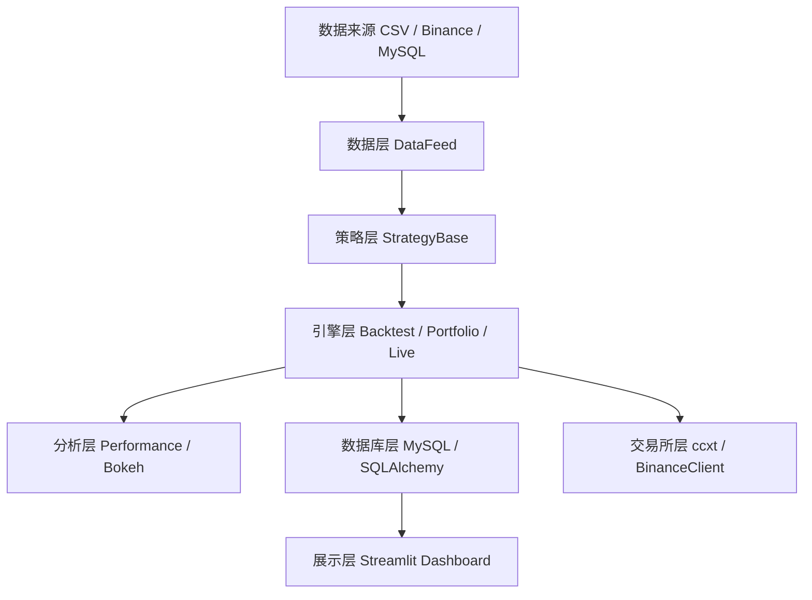

# 从0到1搭建加密货币量化交易框架：项目架构与技术栈选型

---

- 作者：山财小蒋
- 联系方式：2018036661@qq.com
- 项目地址：https://github.com/jianglang740/crypto_quant_framework.git
- 创作不易，转载请注明出处，欢迎批评探讨

---

- **写在前面：这篇文章是整个“加密货币量化框架项目”系列的总览篇。相比单纯展示某一个策略收益，我更想通过这个系列记录自己如何把数据、策略、回测、数据库、可视化和实盘验证串成一个完整工程。**

- **如果从学习复盘的角度看，这个项目最核心的价值不是“某个策略赚了多少”，而是帮助我理解量化系统工程链路：数据怎么进来，策略怎么表达，订单怎么撮合，结果怎么评估，运行状态怎么沉淀，最后如何逐步走向模拟实盘。**

---

## 1. 为什么要自己搭一个量化框架

在学习量化交易的早期，我们很容易停留在“写一个策略脚本，然后跑出一张收益曲线”的阶段。这样的方式可以帮助我们快速验证想法，但随着策略数量增加、数据来源变多、回测结果需要保存、实盘状态需要监控，单文件脚本很快就会变得难以维护。

因此，我在这个项目中尝试搭建了一个加密货币量化交易框架。它的目标不是直接提供所谓“稳定盈利策略”，而是提供一个清晰、可读、可扩展的工程骨架，让策略研究能够逐渐从脚本式实验走向模块化系统。

这个框架围绕 Binance 加密货币市场展开，覆盖了从行情数据、数据清洗、策略开发、单策略回测、多策略组合回测、绩效分析、数据库沉淀、图表报告，到 dry-run 模拟实盘和 Binance Testnet 验证的完整流程。

## 2. 项目整体架构

从工程分层看，项目可以拆成七层：



每一层只负责相对明确的职责：

| 层次 | 主要职责 |
| --- | --- |
| 数据层 | 统一 CSV、Binance、MySQL 数据为 DataFeed |
| 策略层 | 定义策略生命周期、账户、持仓、订单和成交对象 |
| 引擎层 | 驱动策略运行，完成回测撮合或实盘下单 |
| 交易所层 | 基于 ccxt 封装 Binance 行情和交易接口 |
| 分析层 | 计算收益、回撤、夏普、Sortino、Calmar 等指标 |
| 数据库层 | 保存 K 线、订单、成交、权益曲线、实盘快照 |
| 展示层 | 使用 Bokeh 和 Streamlit 做策略复盘与仪表盘 |

这样的拆分带来的好处是：策略不用关心数据从哪里来，引擎不用关心图表怎么画，数据库也不会强制侵入每一次回测。每个模块都可以单独学习、单独测试、单独扩展。

## 3. 技术栈选型

项目核心技术栈如下：

| 技术 | 作用 |
| --- | --- |
| Python 3.11+ | 主体开发语言 |
| ccxt | 连接 Binance，统一行情和交易 API |
| pandas / numpy | 数据读取、清洗、指标计算 |
| Decimal | 金融金额、价格、数量的高精度计算 |
| SQLAlchemy | ORM 模型与数据库访问封装 |
| PyMySQL | MySQL 驱动 |
| Bokeh | 生成交互式回测报告 |
| Streamlit | 构建只读量化仪表盘 |
| MySQL | 存储行情、回测和实盘运行数据 |

这里比较重要的一点是：项目在资金、价格、数量等计算上使用 `Decimal`，而不是直接使用 `float`。在普通数据分析中，`float` 往往够用，但量化交易涉及订单数量、手续费、保证金和盈亏结算，精度问题会不断累积，所以在核心交易对象中使用 `Decimal` 更稳妥。

### 3.1 Python 3.11+ 在项目里承担什么

Python 是整个项目的主体语言。它不只是用来写策略脚本，而是承担了完整框架的组织工作：

1. 用 `dataclass` 定义配置、K 线、账户、持仓、订单和成交对象；
2. 用类型注解表达模块之间的数据结构；
3. 用面向对象方式抽象 `StrategyBase`、`BacktestEngine`、`LiveEngine`、`BinanceClient`；
4. 用标准库 `Decimal`、`datetime`、`uuid` 处理金融数值、时间和订单 ID；
5. 用包结构把数据层、策略层、引擎层、数据库层和可视化层拆开。

也就是说，这个项目里的 Python 不是“写一个脚本跑结果”，而是用来搭一个可复用的量化研究框架。

### 3.2 ccxt 在项目里怎么用

`ccxt` 主要负责连接 Binance。它可以统一调用交易所接口，例如获取 K 线、查询余额、创建订单、撤销订单等。

项目里没有让策略直接调用 ccxt，而是在 `crypto_quant/exchange/binance_client.py` 里封装了一层 `BinanceClient`：

```text
策略 OrderRequest
  -> LiveEngine
  -> BinanceClient
  -> ccxt
  -> Binance / Testnet
```

这样做有几个好处：

1. 策略代码不需要知道 ccxt 的参数细节；
2. 可以在客户端层统一处理现货和合约模式；
3. 可以在下单前统一校验数量、价格、最小名义价值；
4. 可以区分普通查询异常和真实下单异常；
5. 后续如果换交易所，也能尽量减少策略层改动。

在数据层，ccxt 还可以用来拉取 Binance 历史 K 线，再转换成框架内部的 `BarData`。在实盘层，它则负责真实或测试网的下单和查询。

### 3.3 pandas 和 numpy 在项目里怎么用

`pandas` 更适合处理表格数据，`numpy` 更适合做向量化数值计算。项目中它们主要出现在三类场景：

1. 读取 CSV 后整理 K 线字段；
2. 对 close 序列计算收益率、指标和信号；
3. 在具体策略中做批量预计算，例如递归 CUSUM 策略先把收盘价转成 DataFrame，再计算 log return。

例如 CUSUM 策略中的核心收益率计算可以理解为：

```python
log_return = np.log(close / close.shift(1)).fillna(0)
```

这里 pandas 负责按时间序列对齐 close，numpy 负责计算对数收益率。计算完成后，策略再把信号按 `DataFeed.cursor` 对齐到每一根 K 线。

需要注意的是，pandas/numpy 适合研究和指标计算，但账户结算、保证金、手续费这类资金逻辑仍然使用 `Decimal`，避免浮点误差影响交易结果。

### 3.4 Decimal 在项目里怎么用

`Decimal` 出现在项目的很多核心对象中，例如：

```text
BarData.open/high/low/close/volume
Account.cash/equity/available/margin
Position.amount/entry_price/mark_price
Trade.amount/price/fee
BacktestConfig.initial_cash/commission_rate/leverage
```

原因很简单：量化系统经常要做金额、数量、手续费和盈亏计算。如果使用 float，可能出现类似 `0.1 + 0.2 != 0.3` 这样的二进制浮点误差。单次误差可能很小，但订单数量多了以后会累积。

项目中的典型计算包括：

```text
notional = price * amount
fee = notional * commission_rate
required_margin = notional / leverage
unrealized_pnl = (mark_price - entry_price) * amount
```

这些都属于金融计算，所以使用 `Decimal` 更符合框架设计。

### 3.5 SQLAlchemy、PyMySQL 和 MySQL 在项目里怎么配合

数据库层的组合是：

```text
SQLAlchemy ORM -> PyMySQL 驱动 -> MySQL 数据库
```

MySQL 负责真正保存数据，PyMySQL 是 Python 连接 MySQL 的驱动，SQLAlchemy 则负责把 Python 类映射成数据库表。

项目里会先定义 ORM model，例如 K 线表、订单表、成交表、权益曲线表；然后通过 repository 封装读写方法，例如保存 K 线、保存回测结果、查询某次运行的订单和成交。

这样业务层不用到处写 SQL：

```text
业务代码
  -> repository.save_backtest_result(...)
  -> SQLAlchemy model
  -> MySQL
```

这套设计让数据库不是临时存储，而是整个量化框架的结果沉淀层。

### 3.6 Bokeh 和 Streamlit 在项目里怎么分工

Bokeh 和 Streamlit 都是可视化工具，但在项目里的职责不同。

Bokeh 用来生成单次回测的交互式 HTML 报告：

```text
BacktestResult + DataFeed
  -> PerformanceAnalyzer
  -> BokehBacktestReport
  -> HTML 报告
```

报告里会展示权益曲线、回撤曲线、价格走势、买卖点和单笔盈亏图。

Streamlit 则更像一个只读 dashboard：

```text
MySQL
  -> repository 查询
  -> DashboardData
  -> Streamlit 页面
```

它适合展示多次运行记录、订单、成交、权益曲线、账户快照和持仓快照。项目中特别把 dashboard 做成只读，不在页面里下单，也不修改数据库，这样展示层和交易执行层边界更清楚。

## 4. 核心数据流

框架中的核心数据流可以概括为：

```text
BarData
  -> DataFeed
  -> StrategyBase.on_bar()
  -> OrderRequest
  -> LocalOrder
  -> Trade
  -> Account / Position
  -> BacktestResult / Database / Report
```

其中：

- `BarData` 表示单根 K 线；
- `DataFeed` 管理一组 K 线，并在回测时逐根推进；
- `StrategyBase` 接收行情，产生交易意图；
- `OrderRequest` 表示策略发出的下单请求；
- `LocalOrder` 表示框架内部跟踪的订单状态；
- `Trade` 表示已经成交的交易记录；
- `Account` 和 `Position` 记录账户和持仓变化；
- `BacktestResult` 汇总回测后的成交、订单、权益曲线和最终账户状态。

这个链路让策略开发者只需要关注“在什么情况下下单”，而不需要在策略代码里手写撮合、手续费、账户结算和结果统计。

## 5. 为什么不是直接使用现成框架

Backtrader、vn.py、freqtrade 等成熟框架都很强，但我自己实现一个框架的目的并不是替代它们，而是通过亲手拆解数据、策略、订单、撮合、绩效、实盘接口这些模块，真正理解量化系统背后的工程逻辑。

对于学习量化系统设计来说，自己实现一个框架有几个价值：

1. 能体现对量化交易流程的整体理解；
2. 能体现 Python 工程化能力，而不是只会写孤立脚本；
3. 能把数据、数据库、可视化、交易所 API 串成一个完整项目；
4. 能真正理解每个模块为什么存在、如何协作、有什么限制。

当然，这个项目目前更适合作为学习型、研究型和验证型框架，还不能直接等同于成熟生产级交易系统。真实资金交易前，还需要更完善的风控、日志、告警、密钥管理、异常恢复和人工兜底机制。

## 6. 这个系列后续会写什么

这篇是总览，后面我会继续从以下角度展开：

- 数据层如何设计 DataFeed 和数据线；
- StrategyBase 如何抽象账户、持仓、订单和生命周期；
- 回测引擎如何处理信号延迟、撮合、手续费和滑点；
- 合约模式下如何建模杠杆、保证金和强平；
- 如何计算策略绩效指标；
- 如何用 MySQL 沉淀回测和实盘数据；
- 如何用 Bokeh 和 Streamlit 做可视化复盘；
- 如何接入 ccxt 和 Binance Testnet 做模拟实盘验证。

对我来说，这个项目最大的意义不是某一个策略，而是把量化研究从“零散脚本”推进到“可复用框架”的过程。

## 7. 对照源码理解项目结构

为了让这篇文章不是停留在概念层面，我们可以把前面的分层和项目目录对应起来看：

```text
crypto_quant/
├── config.py                 # 所有配置对象
├── enums.py                  # 交易模式、订单方向、订单状态等枚举
├── data/                     # 数据层
├── strategy/                 # 策略基类
├── engine/                   # 回测、组合回测、实盘引擎
├── exchange/                 # Binance / ccxt 客户端
├── database/                 # MySQL ORM 和 repository
└── analysis/                 # 绩效分析与图表报告
```

其中 `config.py` 是整个项目的配置入口，它定义了：

- `BinanceConfig`：交易所 API、现货/合约模式、sandbox、代理、ccxt options；
- `MySQLConfig`：MySQL 主机、端口、用户名、密码、数据库名、字符集；
- `BacktestConfig`：初始资金、手续费、滑点、杠杆、保证金模式、维持保证金率；
- `LiveConfig`：dry_run、轮询间隔、同步间隔、初始资金、实盘同步交易对；
- `FrameworkConfig`：把前面几个配置组合成一个整体配置对象。

这说明项目不是把参数散落在脚本里，而是先把配置抽象出来。这样后续无论是回测、实盘还是 dashboard，都可以复用同一套配置思想。

## 8. 这个项目的主线不是策略，而是框架

很多量化文章会直接从策略讲起，例如均线策略、动量策略、反转策略。但这个项目更适合从框架主线理解：

```text
数据标准化
  -> 策略标准化
  -> 订单标准化
  -> 回测和实盘执行标准化
  -> 结果分析和存储标准化
```

为什么要强调“标准化”？因为当项目只有一个策略时，怎么写都能跑；但当策略越来越多、数据来源越来越多、运行方式越来越多时，如果没有统一抽象，代码会很快失控。

例如：

- 如果每个策略都自己读 CSV，后面换成 Binance 数据就要全部改；
- 如果每个策略都自己计算账户余额，回测结果就很难比较；
- 如果订单没有统一对象，实盘和回测就无法共享策略接口；
- 如果结果不结构化保存，后面就无法做 dashboard 和长期复盘。

所以这个框架最重要的思想是：先搭一套“量化研究流水线”，再把具体策略放进去验证。

## 9. 学习这个项目的推荐阅读顺序

如果我是第一次阅读这个项目，我建议按下面顺序：

1. 先读 `README.md`，了解整体功能；
2. 再读 `crypto_quant/data/feed.py`，理解数据如何逐根推进；
3. 再读 `crypto_quant/strategy/base.py`，理解策略如何表达交易意图；
4. 再读 `crypto_quant/engine/backtest.py`，理解订单如何撮合、账户如何变化；
5. 再读 `crypto_quant/analysis/performance.py`，理解回测结果如何评价；
6. 再读 `crypto_quant/database/models.py` 和 `repository.py`，理解数据如何沉淀；
7. 最后读 `live.py` 和 `binance_client.py`，理解实盘链路。

这个顺序是从“离交易最远的数据结构”逐步走到“离真实交易最近的执行链路”，比较适合系统学习。

## 10. 一个最小回测闭环应该包含什么

如果把这个框架压缩到一个最小可运行闭环，它至少需要下面几个步骤：

```text
准备 K 线数据
  -> 转换成 DataFeed
  -> 创建 StrategyBase 子类
  -> 创建 BacktestEngine
  -> engine.run(strategy, data)
  -> 得到 BacktestResult
  -> 用 PerformanceAnalyzer 分析
  -> 用 BokehBacktestReport 输出报告
```

这条闭环非常重要，因为它把量化项目中最核心的“研究流程”跑通了：数据进入框架，策略产生订单，引擎模拟成交，账户状态变化，最后输出结果和图表。

如果只写策略函数，最多只能说明“我有一个交易想法”；但跑通这个闭环，才说明这个想法可以被标准化验证、复盘和比较。

## 11. 配置对象如何串联模块

项目里没有把手续费、杠杆、数据库地址、API key、dry-run 开关散落在各个脚本中，而是集中放到配置对象里。

可以这样理解几类配置的作用：

| 配置对象 | 主要影响 |
| --- | --- |
| `BacktestConfig` | 回测初始资金、手续费、滑点、杠杆、维持保证金率 |
| `LiveConfig` | dry-run、轮询间隔、同步间隔、实盘初始资金和同步交易对 |
| `BinanceConfig` | ccxt 初始化、现货/合约模式、sandbox/testnet、代理和 API 凭据 |
| `MySQLConfig` | 数据库连接地址、用户名、密码、库名和字符集 |
| `FrameworkConfig` | 将多个配置组合成项目级配置入口 |

这种配置集中化的好处是：同一个策略可以在不同环境中运行。例如回测时使用 `BacktestConfig` 控制手续费和滑点；测试网运行时使用 `LiveConfig` 和 `BinanceConfig` 控制 dry-run、sandbox 和交易所连接；保存结果时再通过 `MySQLConfig` 连接数据库。

## 12. 从脚本到框架的关键变化

从单个策略脚本走向量化框架，最关键的变化不是代码变多，而是职责变清楚：

| 脚本式写法 | 框架式写法 |
| --- | --- |
| 策略里直接读 CSV | 数据层统一生成 DataFeed |
| 策略里直接改现金和仓位 | 策略只提交 OrderRequest |
| 手续费和滑点随手写 | 回测配置统一控制 |
| 结果只打印到终端 | BacktestResult 结构化返回 |
| 图表临时画一张 | Bokeh 报告和 Streamlit 仪表盘统一展示 |
| 每次实验难以追踪 | MySQL 用 run_id 串联订单、成交和权益曲线 |

这也是这个项目最值得总结的地方：它不只是把一个策略跑起来，而是把策略研究需要的基础设施逐步补齐。

## 免责声明

本文仅为个人学习和项目复盘，不构成任何投资建议。加密货币市场波动极大，任何策略在真实市场中都可能失效，真实交易前必须进行充分回测、模拟盘验证和风险控制。
