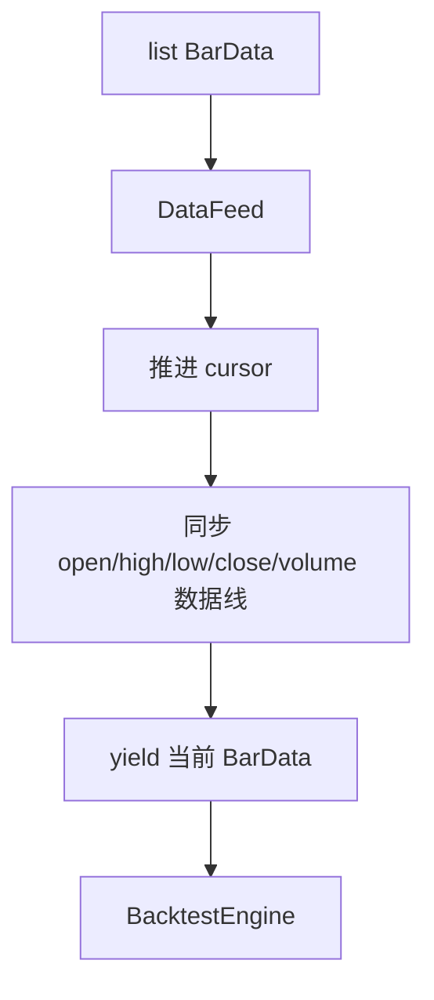

# 量化框架的数据层设计：K线、DataFeed、游标机制与数据清洗

---

- 作者：山财小蒋
- 联系方式：2018036661@qq.com
- 项目地址：https://github.com/jianglang740/crypto_quant_framework.git
- 创作不易，转载请注明出处，欢迎批评探讨

---

- **这一篇文章主要讲框架的数据层。量化系统里最容易被忽视的部分往往不是策略，而是数据：时间有没有对齐、K 线有没有重复、有没有偷看未来、不同来源的数据能不能统一喂给策略，这些都会直接影响回测结果是否可信。**

- **所以我没有让策略直接依赖 pandas DataFrame 或交易所原始返回值，而是先设计了 `BarData -> DataFeed -> DataLine` 这一层抽象，把数据统一成回测引擎可以逐根推进的形式。**

---

## 1. 数据层为什么重要

量化交易的第一步不是写策略，而是处理数据。策略能不能正确运行，很大程度上取决于数据是否统一、干净、可迭代、可复用。

在这个加密货币量化框架中，数据可能来自三类来源：

1. 本地 CSV 文件；
2. Binance 历史 K 线接口；
3. MySQL 中已经存储的 K 线数据。

如果每一种数据源都让策略单独处理，策略代码就会变得非常混乱。因此我在项目中设计了一个统一的数据入口：无论数据最初来自哪里，最终都转换成 `BarData` 列表，再包装成 `DataFeed`，交给回测引擎和策略使用。

## 2. BarData：单根 K 线对象

`BarData` 是数据层最基础的对象，用来表示一根 K 线：

```python
@dataclass(frozen=True, slots=True)
class BarData:
    symbol: str
    timeframe: str
    datetime: datetime
    open: Decimal
    high: Decimal
    low: Decimal
    close: Decimal
    volume: Decimal
```

它包含交易对、周期、时间、开高低收和成交量。这里有两个设计点值得注意：

- 使用 `frozen=True`，表示单根 K 线创建后不应该被随意修改；
- 使用 `Decimal` 保存价格和成交量，减少金融计算中的浮点误差。

这和普通 pandas DataFrame 不冲突。DataFrame 适合批量分析，`BarData` 更适合在回测引擎中逐根推进。

## 3. DataLine：借鉴 Backtrader 的数据线思想

项目中的 `DataLine` 借鉴了 Backtrader 的“Lines”思想。也就是说，一组 K 线不仅可以看成一根一根的 bar，也可以拆成多条序列：

```text
open 线
high 线
low 线
close 线
volume 线
datetime 线
```

这样策略中就可以用类似下面的方式获取数据：

```python
data.close[0]     # 当前收盘价
data.close[-1]    # 上一根收盘价
data.close.window(20)  # 最近 20 根收盘价
```

这里的关键是游标机制。`DataFeed` 每推进一根 K 线，所有 `DataLine` 的 cursor 都同步移动。策略看到的 `data.close[0]` 永远是当前 bar 的 close，而不是全局最后一根 K 线。

这种设计非常适合写均线、动量、反转等策略，因为很多指标都依赖“当前值”和“过去窗口”。

## 4. DataFeed：回测引擎的数据播放器

`DataFeed` 的作用可以理解为“历史行情播放器”。它内部保存所有 `BarData`，并在回测时逐根吐出：



回测引擎中会执行类似：

```python
for bar in data:
    strategy.on_bar(bar)
```

每循环一次，`DataFeed` 就推进一次 cursor。这样策略既可以通过参数 `bar` 访问当前 K 线，也可以通过 `self.data.close.window(20)` 访问历史窗口。

## 5. CSV、Binance、MySQL 的统一入口

项目数据层不是只服务本地文件，而是提供多个来源：

| 来源 | 模块 | 作用 |
| --- | --- | --- |
| CSV | `csv_loader.py` | 读取本地 K 线文件并转换为 BarData |
| Binance | `fetcher.py` | 基于 ccxt 拉取交易所历史 K 线 |
| MySQL | `source.py` / `repository.py` | 从数据库读取已保存的 K 线 |
| Pipeline | `pipeline.py` | Binance 拉取、清洗、入库、回读闭环 |

这意味着策略层不需要关心数据来自 CSV 还是交易所接口，只要最终拿到 `DataFeed` 即可。

### 5.1 pandas 在 CSV 清洗里怎么用

CSV 文件进入项目时，最适合先用 pandas 读取成 DataFrame。原因是 K 线本质上就是表格数据：每一行是一根 K 线，每一列是 open、high、low、close、volume 等字段。

一个典型处理流程是：

```text
pd.read_csv()
  -> 解析 datetime 列
  -> 按 datetime 排序
  -> 去掉重复时间
  -> 检查 open/high/low/close/volume 是否为空
  -> 将数值字段转换为 Decimal
  -> 逐行生成 BarData
```

pandas 适合完成前半段“表格整理”，但最终不能让策略直接依赖 DataFrame。因为 DataFrame 可以任意访问整列数据，策略如果使用不小心，很容易在回测中看到未来数据。

所以项目的做法是：用 pandas 做数据导入和清洗，再转换成 `DataFeed`，由游标机制控制策略在每个时刻能看到什么。

### 5.2 为什么清洗后还要生成 BarData

清洗后的 DataFrame 虽然已经比较干净，但它仍然是外部数据结构。框架内部更希望使用稳定的领域对象：

```text
一行 DataFrame
  -> BarData(symbol, timeframe, datetime, open, high, low, close, volume)
```

这样后续模块只依赖 `BarData`，而不依赖 CSV 字段名、Binance 原始返回格式或数据库 ORM 对象。

这个转换层很重要，它让数据来源和策略运行解耦。以后即使新增一个数据源，比如从 Parquet、API 或其他数据库读取，只要最终能生成 `BarData`，后面的回测逻辑就不需要改变。

## 6. K 线清洗与质量控制

真实行情数据并不一定完美，尤其是多来源数据合并时，可能出现：

- 时间顺序混乱；
- 重复 K 线；
- OHLC 字段缺失；
- high 小于 low；
- open、close 超出 high/low 区间；
- 中间有缺失时间段。

因此数据清洗模块需要完成排序、去重、合法性校验和缺失区间检查。对于量化系统来说，这一步非常重要，因为脏数据会直接影响策略信号和绩效结果。

比如，如果某一根 K 线的 high/low 异常，限价单成交判断、止损止盈判断、回撤统计都可能被污染。数据层越稳，后面的策略和回测才越可信。

## 7. 数据层设计的工程价值

这个数据层的核心价值在于：

1. 把不同数据源统一成相同的数据结构；
2. 用游标机制模拟真实时间推进，避免策略偷看未来数据；
3. 用数据线窗口支持技术指标计算；
4. 把清洗和校验前置，减少策略层负担；
5. 为后续数据库、回测、可视化提供统一接口。

从学习角度看，数据层是整个量化框架的地基。只有数据流清晰，策略层、回测层和实盘层才能真正模块化。

## 8. 数据层源码阅读路线

这一篇对应的核心源码主要在：

```text
crypto_quant/data/feed.py
crypto_quant/data/csv_loader.py
crypto_quant/data/fetcher.py
crypto_quant/data/cleaner.py
crypto_quant/data/source.py
crypto_quant/data/pipeline.py
crypto_quant/data/time_utils.py
```

可以按下面顺序阅读：

1. `feed.py`：先理解 `BarData`、`DataLine`、`DataFeed`；
2. `csv_loader.py`：看本地 CSV 如何转换成 `BarData`；
3. `fetcher.py`：看 ccxt 拉取 Binance K 线后如何转换；
4. `cleaner.py`：看排序、去重、合法性校验和缺失区间检查；
5. `source.py`：看 CSV、Binance、MySQL 如何统一为 DataFeed；
6. `pipeline.py`：看“拉取 -> 清洗 -> 入库 -> 读回”的完整数据闭环。

这样读的好处是：先理解框架内部想要什么数据格式，再看外部数据如何被转换进来。

## 9. 为什么 DataFeed 要支持窗口访问

策略中经常会写这样的逻辑：

```text
如果最近 20 根 K 线均价 > 最近 60 根 K 线均价，则认为短期趋势强于长期趋势
```

如果没有窗口访问，我们可能每次都要手动切片 DataFrame。但在事件驱动或逐 bar 回测中，策略应该只能看到当前时刻以前的数据。

`DataLine.window(size)` 正好解决这个问题：

```python
recent_close = self.data.close.window(20)
```

它从当前 cursor 往前取最近 20 个 close，不会越过当前时刻，也不会拿到未来数据。这一点对于避免未来函数很重要。

## 10. 数据清洗中最值得注意的几类问题

数据清洗不是形式主义，而是会直接影响回测结果。以 K 线为例，至少要关注：

| 问题 | 可能影响 |
| --- | --- |
| 重复 K 线 | 同一时间被回测两次，导致交易频率异常 |
| 时间乱序 | 策略看到错误时间顺序，指标计算失真 |
| 缺失 K 线 | 均线、收益率、波动率计算不连续 |
| high/low 异常 | 限价单和止损止盈判断错误 |
| open/close 不在 high/low 之间 | 说明数据本身不合法 |
| 时区混乱 | 数据库、图表、实盘时间对不上 |

项目中专门写 `time_utils.py`，也是因为加密货币交易所通常返回 UTC 时间戳，而我们在中文环境下阅读和展示时经常需要北京时间。时间处理如果不统一，后面数据库查询和图表展示都会出问题。

## 11. 数据层和后续模块的关系

数据层不是孤立模块，它会影响整个框架：

```text
DataFeed 游标
  -> 决定策略当前能看到什么
  -> 影响订单产生时间
  -> 影响回测撮合时间
  -> 影响权益曲线时间戳
  -> 影响数据库记录和图表展示
```

所以数据层设计得越清楚，后面的策略、回测、分析和可视化就越稳定。

## 12. DataLine 的偏移访问规则

`DataLine` 最容易误解的地方是下标含义。它不是普通列表里的“第几个元素”，而是以当前 cursor 为基准做相对访问：

| 写法 | 含义 |
| --- | --- |
| `data.close[0]` | 当前 K 线 close |
| `data.close[-1]` | 上一根 K 线 close |
| `data.close[-2]` | 上两根 K 线 close |
| `data.close.window(20)` | 截止当前时刻最近 20 根 close |

这种访问方式很适合事件驱动回测。策略在第 t 根 K 线运行时，只能通过负数下标访问历史，通过 `0` 访问当前值，而不应该访问未来数据。

例如计算最简单的一根 K 线收益率，可以写成：

```python
current_close = self.data.close[0]
previous_close = self.data.close[-1]
return_rate = current_close / previous_close - 1
```

这比直接在 DataFrame 里任意切片更安全，因为它天然围绕“当前时刻”组织数据。

## 13. CSV 加载到 DataFeed 的过程

本地 CSV 数据进入框架时，大致会经历下面几步：

```text
读取 CSV 文件
  -> 解析 datetime/open/high/low/close/volume
  -> 转换价格和数量为 Decimal
  -> 生成 BarData 列表
  -> 按时间排序
  -> 包装成 DataFeed
```

这一层转换的意义是把外部文件格式和策略代码隔离开。即使后面 CSV 字段名、时间格式或数据来源发生变化，只要最终仍然输出 `DataFeed`，策略和回测引擎就不需要跟着改。

如果把策略直接写死在某个 CSV 字段结构上，短期看很快，但后面接 Binance、MySQL 或其他数据源时会非常麻烦。

## 14. Binance K 线为什么也要转换成 BarData

ccxt 返回的 Binance K 线通常是列表结构，例如：

```text
[timestamp, open, high, low, close, volume]
```

这种格式适合接口传输，但不适合作为框架内部长期使用的数据对象。原因是列表下标没有语义，读代码时很难看出 `item[3]` 到底是 high 还是 low。

转换成 `BarData` 后，每个字段都有明确含义：

```text
bar.open
bar.high
bar.low
bar.close
bar.volume
```

这样后面的清洗、回测、数据库保存和图表展示都能复用同一个数据结构。

## 15. 数据层当前的边界

当前数据层已经覆盖了学习型量化框架最核心的部分，但仍然有边界：

1. 主要处理 K 线数据，没有引入 order book；
2. 没有模拟成交量约束和盘口深度；
3. 缺失 K 线目前更偏检查和提示，没有自动补全全部场景；
4. 多交易对同步还可以继续增强；
5. 实盘行情目前更适合轮询式使用，后续可以接 WebSocket。

这些边界并不影响它作为回测框架的数据地基。相反，先把 K 线数据流、游标访问和多数据源统一做好，后面再扩展订单簿、tick 数据或多品种同步会更稳。

## 免责声明

本文仅为个人项目学习复盘，不构成投资建议。数据清洗和回测设计只能提高研究流程的规范性，不能保证任何策略在真实市场中盈利。
