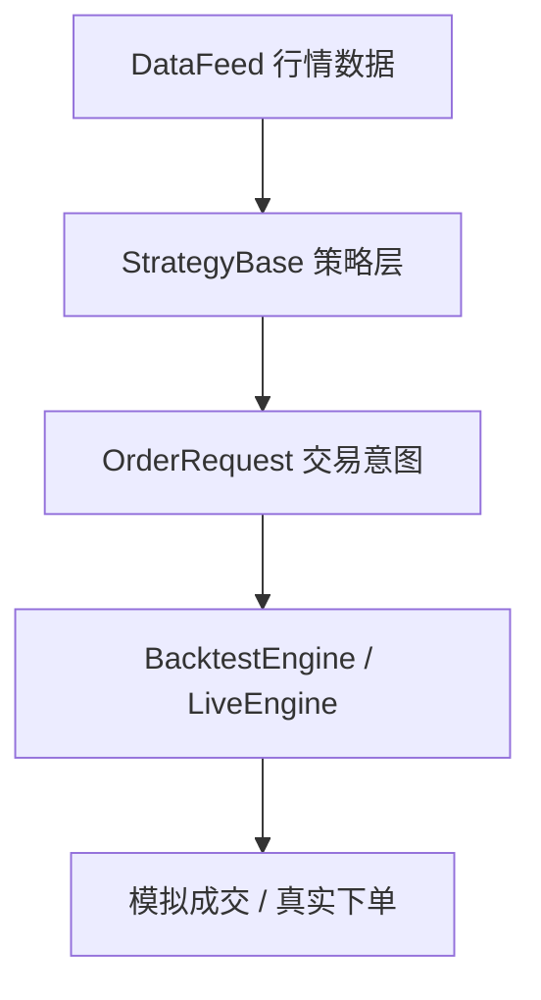

# 如何设计一个可扩展的StrategyBase：账户、持仓、订单与生命周期钩子

---

- 作者：山财小蒋
- 联系方式：2018036661@qq.com
- 项目地址：https://github.com/jianglang740/crypto_quant_framework.git
- 创作不易，转载请注明出处，欢迎批评探讨

---

- **这一篇文章主要复盘策略层设计。对我来说，写策略不能只是堆 if-else，更重要的是先想清楚：策略应该负责什么，不应该负责什么。**

- **在这个框架里，策略只表达交易意图；至于订单如何撮合、账户如何更新、实盘如何下单，都交给引擎层处理。这个边界划清楚以后，后面做回测、组合回测和模拟实盘才不会互相缠在一起。**

---

## 1. 策略基类解决什么问题

在量化项目中，如果每一个策略都从零开始写账户、持仓、下单、成交记录，很快就会产生大量重复代码。更麻烦的是，不同策略之间的写法不统一，后续接入回测引擎、实盘引擎和绩效分析模块时会非常困难。

所以我在项目中设计了 `StrategyBase`。它不是具体策略，而是所有策略的共同父类，负责定义策略应该具备的状态和接口。

可以把它理解为量化框架中的“策略协议”：只要一个策略继承 `StrategyBase`，并实现 `on_bar()` 等方法，它就可以被回测引擎或实盘引擎驱动。

## 2. 策略层在框架中的位置

策略层位于数据层和引擎层之间：



策略层不直接负责撮合，也不直接调用交易所。它只做三件事：

1. 接收行情；
2. 判断交易信号；
3. 生成标准化的下单请求。

真正的成交、账户更新、订单状态变化，由回测引擎或实盘引擎完成。

## 3. 核心对象关系

`StrategyBase` 周围有五个核心对象：

| 对象 | 作用 |
| --- | --- |
| `Account` | 账户资金、权益、保证金和盈亏状态 |
| `Position` | 某个交易对、某个方向上的持仓状态 |
| `OrderRequest` | 策略发出的下单请求 |
| `LocalOrder` | 框架内部跟踪的订单对象 |
| `Trade` | 已经成交的一笔交易记录 |

它们的关系可以这样理解：

```text
策略产生交易意图
  -> OrderRequest
  -> 引擎创建 LocalOrder
  -> 成交后生成 Trade
  -> 更新 Account 和 Position
```

这种拆分非常重要。`OrderRequest` 只是“我想下单”，`LocalOrder` 才是“订单状态”，`Trade` 则是“已经成交”。如果把这三者混在一起，后续就很难处理撤单、拒单、部分成交和订单状态回调。

## 4. Account 与 Position

`Account` 记录策略账户状态，包括：

- cash：现金余额；
- equity：账户总权益；
- available：可用资金；
- margin：已占用保证金；
- realized_pnl：已实现盈亏；
- unrealized_pnl：未实现盈亏。

在现货模式下，账户比较接近普通现金账户；在合约模式下，还需要考虑保证金、杠杆、未实现盈亏和强平风险。

`Position` 记录持仓状态，包括交易对、方向、数量、开仓均价、标记价格、占用保证金和未实现盈亏。项目中还支持通过 `PositionSide` 区分现货/单向持仓和合约空头持仓。

这两个对象让策略可以在任何时候知道自己当前的资金和仓位状态，而不需要每个策略自己维护一套混乱的变量。

## 5. 下单接口的统一

策略开发者通常不应该直接构造复杂订单对象，而应该调用更直观的接口：

```python
self.buy(symbol, amount)
self.sell(symbol, amount)
self.short(symbol, amount)
self.cover(symbol, amount)
self.close_position(symbol)
```

这些方法最终都会走到 `submit_order()`，生成一个标准化的 `OrderRequest`。

这样的好处是：

1. 策略代码更接近交易语言；
2. 回测和实盘可以复用同一套策略接口；
3. 后续如果要增加限价单、reduce_only、time_in_force 等参数，只需要在统一入口扩展。

## 6. 生命周期钩子

`StrategyBase` 还定义了一组生命周期方法：

| 方法 | 调用时机 |
| --- | --- |
| `on_init()` | 策略初始化时调用 |
| `on_start()` | 策略正式开始前调用 |
| `on_bar(bar)` | 每根 K 线到来时调用 |
| `on_order(order)` | 订单状态变化时调用 |
| `on_trade(trade)` | 成交产生时调用 |
| `on_stop()` | 策略结束时调用 |

其中最核心的是 `on_bar()`，大部分交易信号都在这里产生。但其他钩子也很重要，例如：

- 在 `on_init()` 中预先计算指标；
- 在 `on_trade()` 中记录成交后的状态；
- 在 `on_stop()` 中平仓或保存结果。

这套设计让策略具备了比较清晰的运行节奏，而不是把所有逻辑堆在一个函数里。

## 7. 策略基类的工程价值

从工程角度看，`StrategyBase` 的价值不在于某一个具体方法，而在于它建立了一套统一抽象：

```text
策略只负责表达交易意图；
引擎负责执行交易意图；
账户、持仓、订单、成交由框架统一管理。
```

这使得同一个策略可以在不同环境中运行：

- 在历史数据上由 `BacktestEngine` 驱动；
- 在多策略组合中由 `PortfolioBacktestEngine` 驱动；
- 在 dry-run 或实盘中由 `LiveEngine` 驱动。

对于量化框架来说，这种“策略与执行解耦”的设计非常关键。

## 8. 后续可以优化的方向

目前策略基类已经具备基本能力，但如果继续往生产级方向扩展，还可以考虑：

1. 增加更完整的订单状态机；
2. 支持部分成交；
3. 支持事件驱动而不仅仅是 K 线驱动；
4. 支持多交易对组合策略；
5. 引入独立的风险管理模块；
6. 增加策略参数管理和批量回测能力。

这些方向都可以在现有 `StrategyBase` 抽象上继续演进。

## 9. StrategyBase 源码阅读路线

这一篇主要对应：

```text
crypto_quant/strategy/base.py
crypto_quant/enums.py
```

建议先看 `base.py` 中的数据对象，再看 `StrategyBase` 方法：

1. `Account`：账户资金和权益状态；
2. `Position`：持仓数量、均价、保证金和浮盈浮亏；
3. `OrderRequest`：策略发出的下单请求；
4. `LocalOrder`：框架内部订单状态；
5. `Trade`：成交记录；
6. `StrategyBase`：生命周期、下单接口、持仓查询和平仓接口。

这些对象看似基础，但它们决定了整个框架后续能否扩展。

## 10. 为什么要区分 OrderRequest、LocalOrder 和 Trade

初学时很容易把“下单”和“成交”混在一起。但真实交易系统里，它们是不同阶段：

```text
OrderRequest：策略想要下单
LocalOrder：订单已经提交，正在等待成交或撤销
Trade：订单已经成交，产生真实成交记录
```

举个例子：策略调用：

```python
self.buy("ETH/USDT", Decimal("0.1"))
```

这并不代表已经买到了 ETH。它只是生成一个买入请求。回测引擎可能因为资金不足拒绝它，限价单可能因为价格没有触及而保持 OPEN，实盘中交易所也可能返回错误。

因此，把三个对象拆开，可以让框架更接近真实交易流程。

## 11. 生命周期钩子的使用场景

不同钩子适合放不同逻辑：

| 钩子 | 适合放什么 |
| --- | --- |
| `on_init()` | 预计算指标、初始化参数、准备缓存 |
| `on_start()` | 回测或实盘开始前的启动逻辑 |
| `on_bar(bar)` | 核心交易信号判断 |
| `on_order(order)` | 订单状态变化后的处理 |
| `on_trade(trade)` | 成交后的统计或记录 |
| `on_stop()` | 收尾、平仓、保存结果 |

例如递归 CUSUM 策略就把信号序列放在 `on_init()` 中预计算，在 `on_bar()` 中根据 cursor 取当前信号。这种写法比在每根 K 线里重复计算全部历史数据更清楚。

## 12. 策略层不要做太多事

一个常见误区是把所有功能都写进策略里：读数据、算指标、下单、撮合、算收益、画图。这样写短期看很快，长期看很难维护。

在这个框架中，策略层应该保持克制：

```text
策略层：判断是否买卖
引擎层：处理订单和账户变化
分析层：计算绩效
数据库层：保存结果
展示层：画图和仪表盘
```

这种分工是框架化的基础。

## 13. 从一次 buy 调用看策略层到引擎层的边界

理解 `StrategyBase` 最好的方式，是跟踪一次最普通的买入调用。

当策略在 `on_bar()` 中写下：

```python
self.buy(symbol, amount)
```

它并不会直接修改账户，也不会直接增加持仓，更不会自己假设成交成功。实际链路是：

```text
self.buy()
  -> submit_order()
  -> OrderRequest
  -> engine.submit_order(strategy, request)
  -> LocalOrder
  -> on_order(order)
```

也就是说，策略层只表达“我要买”，而不决定“是否成交、以什么价格成交、账户怎么变化”。这些事情交给回测引擎或实盘引擎处理。

这种边界非常重要。如果策略自己直接改账户，就会导致回测和实盘行为不一致；如果策略只提交标准化订单请求，那么同一个策略就可以被不同引擎复用。

## 14. 为什么没有绑定引擎时也能创建 LocalOrder

`submit_order()` 里有一个细节：如果 `self.engine is None`，它仍然会创建一个本地 `LocalOrder`，并调用 `on_order()`。

这对学习和测试很有帮助。因为我们可以在没有启动完整回测引擎的情况下，单独测试策略是否会生成正确订单。例如：

```text
构造策略对象
调用 strategy.buy(...)
检查 strategy.orders 里是否出现 OPEN 订单
```

这说明 `StrategyBase` 不是一个只能依附引擎运行的空壳，它本身也提供了最小化的订单生命周期表达能力。

不过在真实回测中，订单最终还是应该交给引擎处理。因为只有引擎知道当前 K 线、手续费、滑点、保证金、强平等规则。

## 15. Position key 为什么要包含 symbol 和 side

项目中持仓保存在一个字典里：

```text
positions: dict[str, Position]
```

key 的生成方式类似：

```text
BTC/USDT:LONG
BTC/USDT:SHORT
BTC/USDT:BOTH
```

这样做是为了同时支持现货和合约。

现货通常只需要 `BOTH` 或普通方向，因为没有单独的多空仓位；合约则需要区分 `LONG` 和 `SHORT`，尤其是在支持双向持仓时，多头和空头不能混在一个字段里。

如果不把 side 放进 key，会出现一个问题：同一交易对下的多头和空头可能互相覆盖，导致持仓数量、开仓均价、保证金和未实现盈亏都计算错误。

## 16. reduce_only 在策略层的意义

合约交易里，平仓和平反向开仓必须区分清楚。项目中 `cover()` 和 `close_position()` 会设置 `reduce_only=True`，它的含义是：这个订单只能减少已有仓位，不能因为数量过大或方向错误而变成反向开仓。

例如，平空时本质上是买入：

```text
side = BUY
position_side = SHORT
reduce_only = True
```

如果没有 `reduce_only`，一次本来想平空的买入，在某些情况下可能变成开多。对于合约策略来说，这会让风险暴露完全失控。

所以 `reduce_only` 不是一个细节字段，而是合约策略表达“平仓意图”的关键约束。

## 17. 设计 StrategyBase 时最重要的思想

这套策略基类的核心思想可以总结成一句话：

```text
策略只描述交易意图，引擎负责解释和执行交易意图。
```

因此，策略层应该关注：

1. 当前数据是否满足信号条件；
2. 当前是否已有持仓；
3. 应该开仓、平仓还是不操作；
4. 使用多少仓位；
5. 是否设置只减仓、持仓方向等约束。

策略层不应该关注：

1. 市价单具体按哪根 K 线成交；
2. 手续费怎么扣；
3. 滑点怎么模拟；
4. 保证金是否足够；
5. 强平如何触发；
6. 订单如何写入数据库。

这些都属于引擎层、账户层或数据库层的职责。把边界分清楚后，策略才会更容易扩展，也更容易从回测迁移到模拟实盘。

## 免责声明

本文仅为个人项目学习复盘，不构成任何投资建议。策略框架设计只能提高研究和开发效率，不能保证策略有效或盈利。
