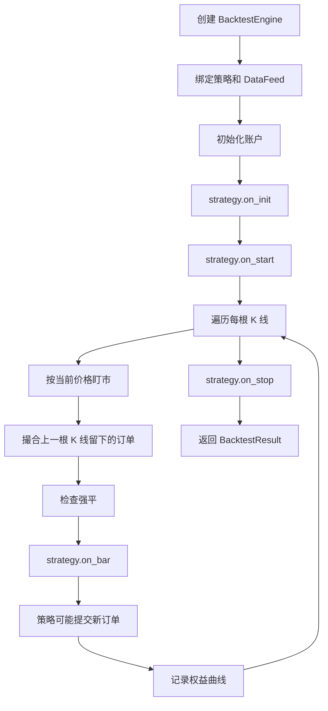

# 加密货币回测引擎设计：信号延迟、撮合机制、手续费与滑点

---

- 作者：山财小蒋
- 联系方式：2018036661@qq.com
- 项目地址：https://github.com/jianglang740/crypto_quant_framework.git
- 创作不易，转载请注明出处，欢迎批评探讨

---

- **这一篇文章进入回测引擎。回测最怕的不是代码跑不起来，而是结果看起来很好，但实际上隐藏了未来函数、低估交易成本，或者成交假设过于理想。**

- **所以我在设计回测引擎时，重点关注四件事：时间顺序是否合理、订单什么时候成交、手续费和滑点是否计入、账户和持仓是否能被正确更新。**

---

## 1. 回测引擎的本质

回测引擎并不是简单地把策略信号乘以未来收益率。一个相对严谨的回测引擎，至少要回答以下问题：

1. 策略在什么时间点看到数据？
2. 策略发出的订单什么时候成交？
3. 成交价格如何确定？
4. 手续费和滑点如何计算？
5. 账户现金、持仓、权益如何更新？
6. 合约模式下保证金和强平如何处理？

在这个项目中，`BacktestEngine` 的定位是：历史行情播放器 + 简化模拟交易所 + 账户结算器。

它不追求毫秒级撮合，也不模拟订单簿深度，而是服务于中低频 K 线策略研究。

## 2. 回测整体流程

回测主流程可以概括为：



这里有一个非常重要的细节：策略在当前 K 线产生的订单，不会立刻在同一根 K 线成交，而是延迟到下一根 K 线撮合。

## 3. 为什么要设计信号延迟

如果策略在当前 K 线收盘价产生信号，又允许它在当前 K 线开盘价、最低价或最高价成交，就会产生明显的未来函数问题。

项目中的假设是：

```text
当前 K 线收盘后产生信号
下一根 K 线开盘时尝试成交
```

这比“当前收盘信号、当前收盘成交”更保守，也更接近实际交易中的时间顺序。

当然，这仍然是一种简化假设。真实市场中还会受到盘口深度、订单排队、网络延迟和成交量限制影响。但对于 5 分钟、15 分钟、1 小时级别的策略，这种设计已经比简单向量化回测更接近真实交易过程。

## 4. 市价单和限价单的撮合

项目中市价单采用下一根 K 线开盘价作为基础成交价：

```text
fill_price = next_bar.open
```

如果设置了滑点，则买入价格上调，卖出价格下调：

```text
买入成交价 = open + slippage
卖出成交价 = open - slippage
```

限价单则需要判断价格是否被当前 K 线触及：

- 买入限价单：如果限价低于当前 K 线最低价，则无法成交；
- 卖出限价单：如果限价高于当前 K 线最高价，则无法成交。

这种撮合模型比较简化，但逻辑清晰，适合学习型框架和低频策略验证。

## 5. 手续费与滑点

在回测中，如果不考虑交易成本，很多策略都会显得过于乐观。尤其是加密货币市场，交易频率较高时，手续费和滑点会明显影响最终收益。

项目中手续费计算方式为：

```text
fee = notional * commission_rate
```

其中：

```text
notional = fill_price * amount
```

滑点则通过 `slippage_rate` 模拟，买入时提高成交价，卖出时降低成交价。

手续费影响账户现金，滑点影响成交价格。两者共同决定策略结果是否足够稳健。

## 6. 现货账户更新

在现货模式下，买入会减少现金，卖出会增加现金。项目中还会检查：

- 是否允许做空；
- 是否有足够现金买入；
- reduce_only 是否超过已有仓位；
- 持仓均价如何更新；
- 平仓时如何计算已实现盈亏。

现货模式相对简单，但仍然需要处理账户现金、持仓数量、开仓均价和成交费用。

## 7. 合约账户更新

合约模式更复杂，因为它涉及：

- 杠杆；
- 保证金；
- 多头和空头；
- 未实现盈亏；
- 已实现盈亏；
- 维持保证金；
- 强平判断。

在项目中，开仓时根据名义价值和杠杆计算所需保证金：

```text
required_margin = notional / leverage
```

平仓时释放部分保证金，并把盈亏计入账户。每根 K 线还会根据当前价格进行盯市，更新未实现盈亏和账户权益。

这部分虽然仍是简化模型，但已经比只看收益曲线的回测更接近真实合约交易。

## 8. BacktestResult

回测结束后，引擎返回 `BacktestResult`，包含：

| 字段 | 含义 |
| --- | --- |
| `trades` | 所有成交记录 |
| `orders` | 所有订单记录 |
| `equity_curve` | 权益曲线 |
| `final_account` | 最终账户状态 |

后续绩效分析、Bokeh 报告、数据库保存，都会依赖这些结果。

## 9. 这个回测引擎的边界

需要承认的是，这个回测引擎不是生产级撮合系统。它目前没有模拟：

1. 订单簿深度；
2. 部分成交；
3. 成交量限制；
4. 资金费率；
5. maker/taker 费率差异；
6. 网络延迟；
7. 交易所风控和限频。

但作为一个学习型框架，它已经覆盖了回测引擎最核心的几个问题：时间顺序、订单状态、成交价格、交易成本、账户和持仓更新。

## 10. 总结

回测引擎的关键不是跑出一个漂亮收益曲线，而是尽可能避免明显的不真实假设。

在这个项目中，我重点处理了：

- 信号延迟，避免未来函数；
- 手续费和滑点，避免结果过度乐观；
- 现货和合约账户分离；
- 订单、成交、账户、持仓的统一对象管理；
- 回测结果结构化输出，便于后续分析和入库。

这也是从策略脚本走向量化框架时最重要的一步。

## 11. BacktestEngine 源码阅读路线

这一篇主要对应：

```text
crypto_quant/engine/backtest.py
crypto_quant/config.py
crypto_quant/strategy/base.py
```

阅读 `backtest.py` 时建议抓住几个核心方法：

| 方法 | 作用 |
| --- | --- |
| `run()` | 回测主循环，驱动策略逐根处理 K 线 |
| `submit_order()` | 接收策略发出的 OrderRequest，生成 LocalOrder |
| `_fill_open_orders()` | 尝试撮合上一轮留下的 OPEN 订单 |
| `_fill_order()` | 生成成交价格、手续费和 Trade |
| `_apply_trade()` | 根据现货或合约模式更新账户和持仓 |
| `_mark_to_market()` | 每根 K 线按当前价格盯市 |
| `_check_liquidation()` | 判断合约账户是否触发强平 |

只要把这几个方法串起来，回测引擎的主线就非常清楚。

## 12. 回测循环中的时间顺序

项目中的时间顺序可以写成：

```text
第 t 根 K 线开始
  -> 更新当前 bar
  -> 按当前价格盯市
  -> 撮合之前提交的 OPEN 订单
  -> 检查是否强平
  -> 调用 strategy.on_bar(bar)
  -> 策略可能提交新订单
  -> 记录权益曲线
进入第 t+1 根 K 线
```

注意：`strategy.on_bar()` 中提交的新订单不会在当前 K 线马上成交，而是要等下一轮 `_fill_open_orders()`。这就是信号延迟设计。

## 13. 手续费和滑点如何进入账户

在 `_fill_order()` 中，成交名义价值为：

```text
notional = fill_price * amount
fee = notional * commission_rate
```

滑点会先调整成交价格，手续费再基于调整后的成交价格计算。这样做更合理，因为滑点改变了实际成交价，手续费应该基于实际成交名义价值。

现货买入时，现金变化大致是：

```text
cash -= notional + fee
```

现货卖出时：

```text
cash += notional - fee
```

合约交易则还要处理保证金占用、释放、已实现盈亏和未实现盈亏。

## 14. 回测引擎的教程式理解

可以把 `BacktestEngine` 想象成一个很简化的交易所：

1. 它接收策略订单；
2. 它决定订单能不能成交；
3. 它计算成交价和手续费；
4. 它更新账户和仓位；
5. 它记录每个时刻账户权益；
6. 它在最后返回完整结果。

这种理解方式比直接陷入代码细节更容易建立整体框架。

## 15. 从源码看订单撮合的最小闭环

`BacktestEngine` 中最重要的闭环是：

```text
submit_order()
  -> LocalOrder(status=OPEN)
  -> _fill_open_orders()
  -> _fill_order()
  -> Trade
  -> _apply_trade()
  -> 更新账户和持仓
  -> on_trade() / on_order()
```

这条链路把策略意图变成了账户变化。

其中 `submit_order()` 只负责创建本地订单，并不会马上成交；`_fill_open_orders()` 会在下一根 K 线开始处理所有 OPEN 订单；`_fill_order()` 决定成交价、手续费和成交记录；`_apply_trade()` 再根据现货或合约模式更新账户。

把这几个方法串起来看，比单独看某个函数更容易理解回测引擎的职责。

## 16. 限价单为什么需要检查 high 和 low

市价单可以直接按照下一根 K 线 open 成交，但限价单不能这样处理。

如果一个买入限价单价格低于当前 K 线最低价，说明这根 K 线根本没有跌到该价格，订单不应该成交：

```text
BUY limit price < bar.low -> 不成交
```

如果一个卖出限价单价格高于当前 K 线最高价，说明这根 K 线没有涨到该价格，也不应该成交：

```text
SELL limit price > bar.high -> 不成交
```

这虽然仍然是简化撮合，但至少避免了限价单无条件成交的问题。真实交易中还会涉及盘口深度、队列位置、部分成交等复杂因素，当前框架先保留了一个适合学习和研究的简化版本。

## 17. 为什么 _apply_trade 要再分现货和合约

订单成交以后，不同交易模式下账户更新方式完全不同。

现货交易主要关注：

```text
买入：现金减少，持仓增加
卖出：现金增加，持仓减少
```

合约交易还要额外处理：

1. 保证金占用；
2. 保证金释放；
3. 多头和空头方向；
4. 已实现盈亏；
5. 未实现盈亏；
6. 维持保证金和强平风险。

所以 `_apply_trade()` 会根据 `trading_mode` 分发到 `_apply_spot_trade()` 或 `_apply_futures_trade()`。这是一种很清晰的分层：撮合逻辑可以共用，但账户结算逻辑必须分开。

## 18. 权益曲线为什么每根 K 线都要记录

回测最终会返回 `BacktestResult`，其中包含 `equity_curve`。这个列表不是只在交易发生时记录，而是在每根 K 线之后记录账户权益。

这样做的好处是：

1. 即使没有交易，也能看到持仓浮盈浮亏的变化；
2. 可以计算最大回撤、波动率、Sharpe 等指标；
3. 可以画出连续权益曲线，而不是稀疏的成交点；
4. 合约持仓的路径风险可以被反映出来。

如果只在成交时记录权益，很多中途回撤会被漏掉，绩效分析会过于乐观。

## 19. 当前回测模型的简化假设

这个回测引擎是学习型和研究型框架，因此有一些简化假设需要明确：

1. 市价单使用下一根 K 线 open 作为成交价；
2. 限价单只用 high/low 判断是否触及；
3. 没有模拟订单排队；
4. 没有模拟部分成交；
5. 滑点是固定比例，而不随成交量和盘口变化；
6. 合约强平使用简化的维持保证金判断。

这些假设并不意味着框架无效，而是说明回测结果需要谨慎解释。后续如果要更接近真实交易，可以逐步增加盘口、成交量、资金费率和交易所规则。

## 免责声明

本文仅为个人项目学习复盘，不构成任何投资建议。回测结果不代表未来表现，真实交易必须考虑更复杂的市场摩擦和风险控制。
