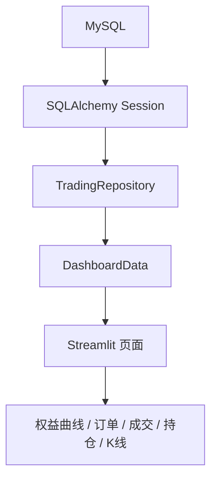

# Bokeh加Streamlit构建量化策略复盘仪表盘

---

- 作者：山财小蒋
- 联系方式：2018036661@qq.com
- 项目地址：https://github.com/jianglang740/crypto_quant_framework.git
- 创作不易，转载请注明出处，欢迎批评探讨

---

- **这一篇文章讲可视化。量化项目如果只有终端输出，其实很难展示完整价值。尤其是在复盘或项目总结时，图表和仪表盘能直观体现策略运行过程、回撤位置、买卖点和账户状态。**

- **所以我在项目中同时使用 Bokeh 和 Streamlit：Bokeh 负责生成单次回测报告，Streamlit 负责读取数据库并做只读仪表盘展示。**

---

## 1. 为什么量化项目需要可视化

回测结束后，如果只看一堆指标，很难快速理解策略表现。比如最大回撤发生在哪里？买卖点是否集中在震荡区间？权益曲线和价格走势是否同步？这些问题都需要图表来辅助判断。

因此，在这个项目中，我设计了两类可视化：

1. Bokeh 回测报告：适合单次策略回测后的交互式复盘；
2. Streamlit 仪表盘：适合从数据库中读取多次回测和实盘记录，做统一展示。

两者定位不同，但都服务于一个目标：让量化结果从“数字”变成“可解释的过程”。

## 2. Bokeh 报告适合做什么

Bokeh 的优势是可以生成交互式 HTML 图表，适合保存和分享。项目中的 Bokeh 报告主要展示：

- 绩效指标表；
- 权益曲线；
- 回撤曲线；
- 价格走势；
- 买卖点标记；
- 单笔平仓盈亏图。

这些图表可以帮助我们从多个角度复盘策略。

例如，只看总收益率，我们可能觉得策略不错；但如果打开回撤曲线，发现中间出现过巨大回撤，就需要重新评估策略的可承受性。

### 2.1 Bokeh 在项目里怎么画图

Bokeh 的基本思路是：先准备数据源，再创建 figure，最后把线、点、柱状图等图形元素加到 figure 上。

在这个项目中，可以把 Bokeh 报告生成理解成：

```text
BacktestResult
  -> 整理 equity_curve / trades / drawdown
  -> ColumnDataSource
  -> figure.line / figure.scatter / figure.vbar
  -> layout
  -> output HTML
```

例如权益曲线适合用 line 图，买卖点适合用 scatter 点，单笔盈亏适合用 vbar 柱状图。不同图表使用同一批回测结果，但关注的问题不同。

### 2.2 为什么使用 ColumnDataSource

`ColumnDataSource` 是 Bokeh 中很重要的数据结构。它可以把图表需要的数据整理成列：

```text
datetime: [t1, t2, t3]
equity: [10000, 10120, 9980]
return: [0, 0.012, -0.0138]
```

之后图表就可以通过字段名引用数据：

```text
x = datetime
y = equity
```

这样做的好处是 HoverTool、缩放、选择等交互功能都可以围绕同一个数据源工作。对回测报告来说，鼠标悬停时能看到时间、权益、收益率、成交价格等信息，比静态图片更适合复盘。

### 2.3 Bokeh 报告如何输出成 HTML

Bokeh 的另一个好处是可以把报告输出成独立 HTML 文件。也就是说，一次回测结束后，可以生成一个可单独打开的报告文件，不一定依赖 dashboard 或数据库。

这对策略研究很实用：每次重要实验都可以保存一份 HTML，后面即使代码改了，也能打开当时的报告复盘。

## 3. Bokeh 报告的数据来源

Bokeh 报告主要依赖两个对象：

```text
BacktestResult + DataFeed
```

其中 `BacktestResult` 提供：

- trades；
- orders；
- equity_curve；
- final_account。

`DataFeed` 提供：

- datetime；
- open/high/low/close；
- volume。

两者结合后，就可以把策略交易行为叠加到市场价格走势上，观察策略是在什么位置买入、卖出、止盈或止损。

## 4. Streamlit 仪表盘的定位

如果说 Bokeh 报告更像“单次回测报告”，那么 Streamlit 仪表盘更像“量化系统前端”。

项目中的 `dashboard/app.py` 是一个只读仪表盘，它从 MySQL 读取数据，展示：

- 首页概览；
- 实盘速览；
- 回测报告；
- 项目说明。

这里我特别强调“只读”。仪表盘不执行下单，也不修改数据库，只负责展示数据。这样可以降低误操作风险，也让展示层和交易执行层保持隔离。

### 4.1 Streamlit 在项目里怎么组织页面

Streamlit 的使用方式和传统前端框架不太一样。它更像是用 Python 脚本描述页面：

```text
读取配置
  -> 查询数据
  -> sidebar 选择运行记录
  -> 主区域展示指标卡片、图表、表格
```

在项目中，页面不会直接散乱查询数据库，而是先整理成 `DashboardData`。然后页面根据 `DashboardData` 渲染不同模块，例如运行记录、订单表、成交表、权益曲线、账户快照和持仓快照。

### 4.2 Streamlit 为什么适合做学习型 dashboard

Streamlit 的优势是开发速度快，适合把 Python 数据对象快速展示成页面。对于这个量化项目来说，它很适合做：

1. 策略运行记录列表；
2. 回测结果概览；
3. 权益曲线展示；
4. 订单和成交表格；
5. 实盘账户、持仓快照查看；
6. 项目说明页面。

它不需要单独写复杂前端，也不需要自己处理大量 JavaScript 交互，适合当前这种以学习、复盘和展示为主的项目阶段。

## 5. 仪表盘的数据链路

Streamlit 仪表盘的数据链路如下：



页面不会直接写 SQL，而是通过 repository 查询数据。这和前面数据库篇的设计保持一致。

## 6. 只读设计的意义

为什么仪表盘不做下单？因为在量化系统中，展示和交易最好分离。

如果把下单按钮放进 dashboard，需要额外处理：

1. 身份认证；
2. 权限控制；
3. 二次确认；
4. 操作日志；
5. 异常回滚；
6. 风控校验。

这些都不是一个学习型仪表盘应该贸然承担的功能。因此项目当前选择只读模式，更安全，也更符合学习型量化系统的边界。

## 7. 页面设计思路

一个好的量化仪表盘，不应该只是把表格堆在页面上，而应该围绕问题组织信息：

- 账户现在怎么样？
- 当前有没有持仓？
- 最近有没有订单和成交？
- 权益曲线是否平稳？
- 回测买卖点是否合理？
- 策略运行记录是否可追踪？

因此，dashboard 中的数据结构被封装为 `DashboardData`，包含 runs、orders、trades、equity_curve、account_snapshots、position_snapshots 和 market_klines。页面渲染函数只负责展示，不直接处理数据库细节。

## 8. Bokeh 与 Streamlit 的分工

两者可以这样分工：

| 工具 | 更适合的场景 |
| --- | --- |
| Bokeh | 单次回测报告、交互式 HTML、策略复盘 |
| Streamlit | 多次运行管理、数据库仪表盘、项目展示 |

Bokeh 更偏报告生成，Streamlit 更偏应用展示。它们结合起来，可以覆盖从研究复盘到项目展示的两个场景。

## 9. 可视化模块的学习价值

从项目学习角度看，可视化模块非常重要。因为它说明项目不只是后端逻辑，还考虑了结果展示、用户体验和复盘流程。

可以这样理解这个模块的价值：

```text
我不仅实现了策略回测，还把回测结果结构化保存到 MySQL，并通过 Bokeh 和 Streamlit 做了可视化复盘。这样可以从收益、回撤、订单、成交、持仓和价格走势多个角度分析策略表现。
```

这比单纯说“我写了一个回测脚本”更能体现工程完整度。

## 10. 总结

量化可视化不是锦上添花，而是策略研究中非常重要的一环。指标告诉我们结果，图表帮助我们理解过程。

在这个项目中，Bokeh 和 Streamlit 分别承担了报告生成和仪表盘展示的职责，让策略从代码运行结果变成可以复盘、可以解释、可以展示的项目成果。

## 11. 可视化模块源码阅读路线

可视化相关代码主要在：

```text
crypto_quant/analysis/bokeh_report.py
dashboard/app.py
dashboard/style.css
```

可以分两条线理解：

```text
单次回测结果 -> BokehBacktestReport -> HTML 报告
MySQL 数据库 -> Streamlit dashboard -> Web 仪表盘
```

Bokeh 更偏“报告”，Streamlit 更偏“应用页面”。

## 12. Bokeh 报告应该展示什么

一个回测报告至少应该包含：

1. 策略基本信息；
2. 绩效指标表；
3. 权益曲线；
4. 回撤曲线；
5. K 线或价格曲线；
6. 买卖点；
7. 成交盈亏分布。

这些内容的作用不一样。权益曲线看账户变化，回撤曲线看风险阶段，价格图上的买卖点看策略行为是否符合预期。

如果只画收益曲线，很容易忽略策略到底在哪里交易、为什么亏损、是否频繁追涨杀跌。

## 13. Streamlit dashboard 的页面逻辑

`dashboard/app.py` 中先通过环境变量读取 MySQL 配置，再通过 repository 加载数据，最后渲染页面。

核心数据对象是 `DashboardData`，它包含：

- runs：最近运行记录；
- selected_run：当前选择的运行；
- orders：订单记录；
- trades：成交记录；
- equity_curve：权益曲线；
- account_snapshots：账户快照；
- position_snapshots：持仓快照；
- market_klines：行情 K 线。

这个对象的作用是把数据库查询结果整理成页面渲染所需的数据结构。页面函数只管展示，不直接关心 SQL 查询细节。

## 14. 为什么 dashboard 要只读

在这个项目中，dashboard 明确是只读页面：

```text
不下单
不撤单
不修改数据库
只展示已有记录
```

这是一个很重要的边界。因为一旦页面支持下单，就必须加入用户认证、权限控制、二次确认、风控校验和操作日志。对于当前学习型项目来说，把 dashboard 做成只读更安全，也更容易保证结构清晰。

## 15. 图表不是装饰，而是调试工具

量化可视化并不只是为了好看，它还是调试工具。例如：

- 买点总出现在快速下跌前，说明信号可能滞后；
- 卖点总出现在上涨初期，说明止盈可能过早；
- 权益曲线剧烈波动，说明仓位或杠杆过高；
- 回撤持续时间很长，说明策略可能不适合当前市场状态。

所以图表的价值在于帮助我们发现策略逻辑和市场行为之间的偏差。

## 16. 从源码看 BokehBacktestReport 的生成流程

`BokehBacktestReport` 的入口很清楚：它接收 `BacktestResult`、可选的 `DataFeed` 和一个 `PerformanceAnalyzer`。

```text
BacktestResult + DataFeed
  -> PerformanceAnalyzer.analyze()
  -> 指标表 + 权益曲线 + 回撤曲线 + 价格交易图 + 单笔盈亏图
  -> HTML 报告
```

在初始化时，报告类会先调用绩效分析器：

```text
self.metrics = analyzer.analyze(result.equity_curve, result.trades)
```

也就是说，Bokeh 报告本身不重新计算策略逻辑，它只负责把已经产生的回测结果转换成图表。这种分工很重要：

1. 策略层负责产生订单；
2. 回测引擎负责撮合和更新账户；
3. 绩效模块负责计算指标；
4. Bokeh 报告负责展示结果。

这样每个模块职责单一，后续即使更换图表库，也不需要改策略或回测引擎。

## 17. Bokeh 报告中的几个核心图表

源码里 `_layout()` 会把多个组件组合成一个纵向页面：

```text
_metrics_table()
_strategy_table()
_equity_curve()
_drawdown_curve()
_price_with_trades()
_trade_pnl_chart()
```

这些组件各自回答不同问题：

| 组件 | 作用 |
| --- | --- |
| metrics table | 展示收益率、回撤、Sharpe、胜率等指标 |
| strategy table | 展示策略维度的交易次数 |
| equity curve | 查看账户权益随时间变化 |
| drawdown curve | 查看风险集中爆发的阶段 |
| price with trades | 把买卖点叠加到价格走势上 |
| trade pnl chart | 查看每笔闭合交易的盈亏分布 |

其中我认为最有价值的是 `price_with_trades`。因为很多策略看指标还不错，但把买卖点画到价格图上之后，会发现交易行为其实并不符合预期，比如追涨杀跌、止盈过早、震荡区间频繁开仓等。

## 18. ColumnDataSource 的作用

Bokeh 画图时大量使用 `ColumnDataSource`。可以把它理解为图表专用的数据表：

```text
{
    "datetime": [...],
    "equity": [...],
    "return": [...]
}
```

图表绘制时不直接从 Python 列表中到处取值，而是先把数据整理成 `ColumnDataSource`，再让 `figure.line()`、`figure.scatter()` 等图形组件引用字段名。

这样做有几个好处：

1. 数据列和图形元素对应关系清晰；
2. HoverTool 可以直接读取字段展示提示信息；
3. 后续如果要扩展交互能力，数据结构更统一；
4. 图表代码不会和原始回测对象强绑定。

例如权益曲线的数据源包含 `datetime`、`equity` 和 `return`，鼠标悬停时就可以同时显示时间、账户权益和收益率。

## 19. Streamlit 页面为什么要先整理 DashboardData

`dashboard/app.py` 中定义了 `DashboardData`，它把页面需要的数据集中在一个对象里：

```text
runs
selected_run
orders
trades
equity_curve
account_snapshots
position_snapshots
market_klines
```

这一步看起来只是“包了一层”，但对页面结构很有帮助。因为 Streamlit 页面不应该到处直接查数据库，否则页面逻辑会和 SQL 查询混在一起。

更清晰的链路是：

```text
环境变量 -> MySQLConfig -> SQLAlchemy Session -> TradingRepository -> DashboardData -> 页面渲染
```

这样页面函数只负责展示，比如渲染指标卡片、表格、曲线和说明文字；数据库查询细节则交给 repository。后续如果数据库表结构调整，只要 repository 和 DashboardData 适配好，页面层可以少改很多。

## 20. 回测页面和实盘页面的数据差异

同样是仪表盘，回测和实盘关注的数据并不完全相同。

回测页面更关注：

1. 策略运行记录；
2. 权益曲线；
3. 历史订单和成交；
4. 回测区间内的行情 K 线；
5. 买卖点和价格走势的对应关系。

实盘速览更关注：

1. 最近账户快照；
2. 当前持仓快照；
3. 最近订单和成交；
4. 账户权益、可用余额和保证金变化；
5. 系统是否持续写入新记录。

所以 dashboard 不是简单复用一张页面，而是根据运行场景组织信息。回测更像“历史复盘”，实盘更像“状态监控”。

## 21. 为什么要把可视化当成系统的一部分

很多量化项目只写到回测脚本就停止了，但真正复盘时会发现：如果没有图表和仪表盘，很难长期维护策略研究流程。

可视化至少解决三个问题：

1. **降低理解成本**：不用每次都翻日志和数据库；
2. **暴露策略问题**：买卖点、回撤区间、单笔盈亏会直接显示出来；
3. **沉淀研究记录**：每次运行结果可以保存、对比和复盘。

因此，Bokeh 和 Streamlit 在这个项目中不是附属功能，而是把“代码能跑”提升到“结果能解释”的关键环节。

## 22. Bokeh 和 Streamlit 为什么同时保留

有了 Streamlit 之后，为什么还要保留 Bokeh 报告？原因是它们解决的问题不同。

Bokeh HTML 报告更像一次实验的“快照”：

```text
一次回测完成
  -> 生成一个独立 HTML
  -> 保存到本地或报告目录
  -> 之后可以单独打开复盘
```

它不依赖数据库服务是否运行，也不依赖 dashboard 是否启动。只要 HTML 文件存在，就能查看这次回测的核心图表。

Streamlit dashboard 更像一个“查询入口”：

```text
多次 run 结果写入 MySQL
  -> dashboard 读取 run 列表
  -> 选择某次运行
  -> 展示订单、成交、权益曲线和账户快照
```

它适合横向比较多次实验和查看实盘记录。一个偏离线报告，一个偏在线查询，两者并不冲突。

## 23. 可视化数据必须和交易数据对齐

画图时有一个容易忽略的问题：价格、成交、权益曲线必须在时间上对齐。

例如：

1. K 线使用 `bar.datetime`；
2. 成交记录使用 `trade.traded_at`；
3. 权益曲线使用回测循环记录的时间戳；
4. 数据库中的 K 线使用 `open_time`；
5. dashboard 读取后还要保证时区展示一致。

如果这些时间字段没有统一，图表上就可能出现买卖点偏移、权益曲线和行情错位、实盘快照看起来滞后的问题。

所以可视化不是简单把数据画出来，它反过来也能检验数据层和数据库层是否设计得足够统一。

## 24. 后续可以继续优化的方向

当前可视化模块已经能完成基础展示，但还有很多可以继续扩展的方向：

1. 给不同策略运行结果增加对比视图；
2. 增加参数筛选和多 run 排序；
3. 增加月度收益、回撤持续时间等高级图表；
4. 对实盘记录增加告警提示，例如权益异常下降、持仓过大；
5. 增加数据更新时间提示，避免误以为旧数据是最新状态；
6. 给 dashboard 增加更清晰的空数据提示和错误说明。

这些优化本质上都围绕一个目标：让策略研究结果更容易被检查、比较和复盘。

## 免责声明

本文仅为个人项目学习复盘，不构成任何投资建议。图表展示只能帮助理解历史回测和运行状态，不能预测未来市场表现。
