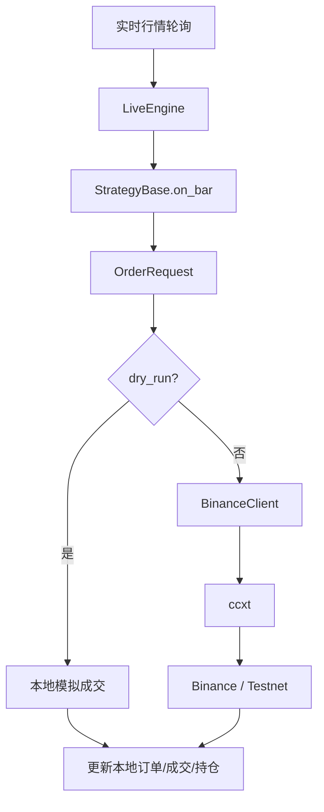

# 从回测到模拟实盘：基于ccxt和BinanceTestnet的交易执行链路

---

- 作者：山财小蒋
- 联系方式：2018036661@qq.com
- 项目地址：https://github.com/jianglang740/crypto_quant_framework.git
- 创作不易，转载请注明出处，欢迎批评探讨

---

- **这一篇文章讲从回测走向模拟实盘。对量化系统来说，回测只是第一步，真正接近实盘时会遇到交易所 API、订单状态同步、网络异常、账户余额、精度规则和密钥管理等问题。**

- **所以我在项目中没有让策略直接调用交易所，而是通过 `LiveEngine + BinanceClient + ccxt` 搭出一条更清晰的执行链路，并用 dry-run 和 Binance Testnet 做逐步验证。**

---

## 1. 为什么不能从回测直接到实盘

量化策略从回测到真实交易，中间不能直接跳跃。回测是在历史数据上模拟，真实市场则有网络延迟、交易所规则、账户状态、订单状态、API 限频和异常返回。

因此，这个项目设计了一条相对保守的验证路径：

```text
历史回测
  -> 多策略组合回测
  -> dry_run 模拟实盘
  -> Binance Testnet 验证
  -> 小资金真实实盘
```

这条路径的核心思想是：每往真实市场靠近一步，都先降低风险，确认上一层逻辑可靠。

## 2. ccxt 在项目中的作用

项目通过 ccxt 连接 Binance。ccxt 的价值在于它统一封装了交易所 API，让我们不用从零处理签名、参数格式和接口路径。

在项目中，ccxt 主要用于：

- 拉取历史 K 线；
- 查询账户余额；
- 查询持仓；
- 创建订单；
- 撤销订单；
- 查询订单状态；
- 设置杠杆和保证金模式。

但项目并没有让策略直接调用 ccxt，而是通过 `BinanceClient` 做了一层封装。

### 2.1 ccxt 初始化时需要哪些配置

在项目里，ccxt 的初始化信息来自 `BinanceConfig`。它会整理出类似下面的配置：

```text
apiKey / secret
trading_mode: spot 或 future
enableRateLimit: 是否启用限频
timeout: 请求超时时间
sandbox: 是否使用测试网
proxies: 代理配置
options.defaultType: spot 或 future
```

其中 `options.defaultType` 很重要。Binance 的现货和合约接口不是完全一样的，如果当前运行的是合约模式，就需要让 ccxt 使用 future 类型；如果是现货模式，就使用 spot 类型。

可以把初始化链路理解为：

```text
BinanceConfig
  -> ccxt_options()
  -> ccxt.binance(config)
  -> BinanceClient.exchange
```

这样做的好处是，交易所连接参数不散落在实盘脚本中，而是集中由配置对象管理。

### 2.2 ccxt 拉取 K 线后还要做什么

ccxt 拉取 Binance K 线后，原始数据通常是数组形式：

```text
[timestamp, open, high, low, close, volume]
```

这种格式不能直接给策略使用。项目会把它转换成 `BarData`：

```text
时间戳 -> datetime
open/high/low/close/volume -> Decimal
symbol/timeframe -> 补充到 BarData 字段
```

转换之后，数据才能进入统一的 `DataFeed`。这一步很关键，因为策略不应该关心数据最初来自 CSV、Binance API 还是 MySQL，只要最终拿到 `DataFeed` 即可。

### 2.3 ccxt 下单参数为什么要再封装

ccxt 的 `create_order` 需要很多参数，例如 symbol、side、type、amount、price、params。对于合约交易，还可能需要：

```text
positionSide
reduceOnly
margin mode
leverage
```

如果每个策略都自己拼这些参数，很容易出错。比如平空本质上是买入，但还要带上 `positionSide=SHORT` 和 `reduceOnly=True`，否则可能从平仓变成反向开仓。

因此项目把这些细节放进 `BinanceClient.create_order()`，让上层只传标准化的 `OrderRequest`，再由客户端转换成交易所需要的参数。

## 3. 为什么要封装 BinanceClient

如果策略直接调用 ccxt，会带来几个问题：

1. 策略和交易所强耦合；
2. 参数校验分散在各个策略里；
3. 异常处理不统一；
4. 以后切换交易所很困难；
5. 回测和实盘接口不一致。

因此项目设计了 `BinanceClient`，统一处理：

- Binance 配置；
- spot / future 模式；
- API key 和 secret；
- sandbox / testnet；
- symbol、数量、价格精度校验；
- 最小下单量、最小名义价值校验；
- 下单、撤单、查询订单；
- 可重试异常和订单异常。

这样策略只需要表达交易意图，引擎负责把意图交给客户端执行。

## 4. LiveEngine 的两种模式

项目中的 `LiveEngine` 支持两种模式：

| 模式 | 含义 | 是否真实下单 |
| --- | --- | --- |
| `dry_run=True` | 模拟实盘 | 否 |
| `dry_run=False` | 真实接口执行 | 是 |

`dry_run` 模式非常重要。它使用实时或准实时行情驱动策略，但订单只在本地模拟成交，不会真正发到交易所。这样可以观察策略在实时市场中的行为，而不用承担真实资金风险。

当 `dry_run=False` 时，引擎会通过 `BinanceClient` 调用交易所接口，进入真实下单或测试网下单流程。

## 5. 实盘引擎的数据流

实盘引擎的数据流可以理解为：



这条链路和回测引擎保持了相似结构：策略仍然只生成 `OrderRequest`，具体执行由引擎负责。

## 6. 状态同步为什么重要

真实交易中，本地状态和交易所状态可能不一致。例如：

- 订单已经在交易所成交，但本地还不知道；
- 网络异常导致下单结果未知；
- 手动在交易所页面平仓；
- API 查询延迟；
- 部分成交后订单仍然挂着。

因此实盘引擎需要定期同步交易所状态，包括：

- 账户余额；
- 持仓；
- 未成交订单；
- 订单状态；
- 成交记录。

项目中的 `LiveConfig` 提供了 `sync_on_start` 和 `sync_interval_seconds` 等配置，就是为了控制启动同步和周期同步。

## 7. Binance Testnet 的价值

Binance Testnet 可以帮助我们在不使用真实资金的情况下验证：

1. API key 是否配置正确；
2. ccxt 参数是否正确；
3. 下单、撤单、查询订单是否正常；
4. 数据库记录器是否能保存账户和订单状态；
5. 实盘引擎的轮询和同步是否稳定。

项目中 `real/` 和 `examples/` 目录下提供了多种测试网脚本，例如余额验证、订单记录、账户快照、持仓和成交记录、周期性实盘记录等。

这些脚本的意义不是追求策略盈利，而是验证交易执行链路是否打通。

## 8. 环境变量与密钥管理

项目通过 `.env.example` 给出环境变量模板，例如：

- MySQL 主机、端口、用户名、密码；
- Binance Testnet API Key；
- Binance Testnet Secret Key；
- 代理配置；
- 测试网运行参数。

真实项目中，密钥不能写死在代码里，也不能提交到 Git 仓库。环境变量是一种基本做法，但如果走向生产，还需要更严格的密钥管理方案。

## 9. 实盘系统还缺什么

当前项目已经具备实盘验证骨架，但还不能直接视为成熟生产级交易系统。后续还需要：

1. 更完善的日志系统；
2. 异常告警；
3. 断线重连；
4. 订单幂等处理；
5. 更严格的风控模块；
6. 最大亏损限制；
7. 人工暂停和兜底机制；
8. 更安全的密钥管理；
9. 长时间模拟盘验证。

这些内容都是真实交易系统必须面对的问题。

## 10. 总结

从回测到实盘，不是简单把 `BacktestEngine` 换成 `LiveEngine`。真正重要的是建立一条逐步验证的链路：先在历史数据中验证策略，再在 dry-run 中观察实时行为，再用 Testnet 验证交易接口，最后才考虑小资金真实交易。

这个项目通过 ccxt、BinanceClient、LiveEngine 和测试网脚本，搭建了从研究到实盘验证的基础桥梁。

## 11. 实盘链路源码阅读路线

这一篇对应的源码主要是：

```text
crypto_quant/exchange/binance_client.py
crypto_quant/engine/live.py
real/run_testnet_smoke_strategy.py
examples/run_binance_testnet_balance.py
examples/run_testnet_order_recorder.py
examples/run_testnet_account_recorder.py
examples/run_testnet_position_and_trade_recorder.py
```

建议先读 `binance_client.py`，再读 `live.py`。因为 `LiveEngine` 最终要通过 `BinanceClient` 执行真实或测试网操作。

## 12. BinanceClient 的封装逻辑

`BinanceClient` 不是简单包一层 ccxt，它做了几类事情：

| 功能 | 说明 |
| --- | --- |
| 初始化 ccxt | 根据 `BinanceConfig` 创建 `ccxt.binance` |
| sandbox | 如果配置 sandbox，则开启测试网模式 |
| market 缓存 | 通过 `load_markets()` 获取交易规则 |
| 订单校验 | 校验数量、价格、最小下单量、最小名义价值 |
| 合约参数 | 处理 `positionSide`、`reduceOnly`、杠杆、保证金模式 |
| 异常封装 | 区分校验异常、可重试异常、订单异常 |
| 重试机制 | 读接口可按配置做有限重试 |

这样做的目的是让上层引擎不直接面对 ccxt 的复杂返回和交易所细节。

## 13. 下单前为什么必须校验交易规则

真实交易所对订单有很多规则，例如：

- 数量精度；
- 价格精度；
- 最小下单数量；
- 最小名义价值；
- 现货是否支持 reduce_only；
- 合约是否需要 positionSide。

如果不提前校验，策略发出的订单可能被交易所拒绝。项目中 `validate_order()` 会先处理这些问题，再调用 `create_order()`。

这一步在回测里可能看起来不重要，但到了实盘或测试网就非常关键。

## 14. LiveEngine 与 BacktestEngine 的相同点和不同点

相同点：

```text
都接收 StrategyBase
都调用 strategy.on_bar(bar)
都处理 OrderRequest
都维护订单、成交、账户和持仓状态
```

不同点：

| 引擎 | 数据来源 | 成交方式 |
| --- | --- | --- |
| BacktestEngine | 历史 DataFeed | 本地模拟撮合 |
| LiveEngine dry_run | 实时或准实时数据 | 本地模拟成交 |
| LiveEngine real/testnet | 实时或准实时数据 | 通过 BinanceClient 下单 |

这种设计让策略接口保持一致，但执行环境可以逐步靠近真实市场。

## 15. LiveConfig 中几个关键参数

`LiveConfig` 决定实盘引擎如何运行。几个核心字段可以这样理解：

| 字段 | 含义 |
| --- | --- |
| `dry_run` | 是否只做本地模拟，不真实下单 |
| `poll_interval_seconds` | 行情轮询间隔 |
| `max_order_retries` | 可重试操作的最大重试次数 |
| `initial_cash` | dry-run 模式下的初始资金 |
| `commission_rate` | dry-run 模式下的手续费率 |
| `slippage_rate` | dry-run 模式下的滑点假设 |
| `leverage` | 合约模式杠杆 |
| `maintenance_margin_rate` | 简化维持保证金率 |
| `sync_on_start` | 启动时是否同步交易所状态 |
| `sync_interval_seconds` | 周期同步间隔 |
| `sync_symbols` | 需要同步持仓或订单状态的交易对 |
| `account_quote_asset` | 账户计价资产，例如 USDT |

这里最重要的是 `dry_run`。只要它是 `False`，策略发出的订单就可能通过 `BinanceClient` 到达交易所或测试网。因此从教程和安全角度看，任何实盘脚本都应该先确认当前模式、API key、sandbox/testnet 配置和交易对。

## 16. dry-run 成交链路更像实时回测

`dry_run=True` 时，`LiveEngine` 不会把订单发到 Binance，而是在本地生成订单和成交记录。它的流程大致是：

```text
策略调用 buy/sell/short/cover
  -> 生成 OrderRequest
  -> LiveEngine 接收订单
  -> 创建本地 LocalOrder
  -> 按当前行情模拟成交
  -> 生成 Trade
  -> 更新 Account / Position
  -> 回调 on_order / on_trade
```

它和历史回测的区别在于数据来源：回测使用固定历史 `DataFeed`，dry-run 使用实时或准实时行情。但二者都不真实下单，因此非常适合验证策略在“接近实时”的环境中会不会频繁开仓、反复反手或触发异常。

## 17. 真实或测试网下单链路

当 `dry_run=False` 时，订单链路会变成：

```text
StrategyBase.submit_order
  -> LiveEngine.submit_order
  -> BinanceClient.create_order
  -> ccxt.create_order
  -> Binance / Binance Testnet
  -> 返回交易所订单结果
  -> 转成本地 LocalOrder
```

这里最需要注意的是：本地生成了订单记录，不代表订单一定完全成交。真实交易所可能返回未成交、部分成交、已取消、已拒绝等状态。因此实盘引擎后续必须继续查询订单状态和成交记录，而不能像最简单的回测那样假设订单立即完成。

这也是为什么订单状态同步和成交同步是实盘系统的核心问题。

## 18. 为什么真实下单不应该随便自动重试

网络请求失败时，直觉上会想“失败就重试”。但真实下单不能这么简单。

假设本地调用 `create_order()` 后超时，可能有两种情况：

1. 订单根本没有到达交易所；
2. 订单已经到达交易所，但本地没有收到返回。

如果这时自动重试，第二种情况就可能造成重复下单。因此项目中更合理的思路是：读请求可以有限重试，例如查询余额、查询订单；但真实创建订单这类有副作用的操作，要非常谨慎，优先通过查询订单状态、客户端订单 ID 或人工确认来处理未知状态。

## 19. 实盘链路最需要补强的地方

当前项目已经打通基础链路，但如果继续往真实系统走，还需要补充：

1. 更完整的日志和告警；
2. 订单幂等和重复下单保护；
3. WebSocket 行情和订单推送；
4. 资金费率和真实手续费处理；
5. 最大亏损、最大仓位、黑名单交易对等风控；
6. API key 更安全的管理方式；
7. 程序异常退出后的恢复机制；
8. 实盘运行报表和人工干预开关。

这些内容也是学习量化实盘系统时必须逐步补上的部分。

## 免责声明

本文仅为个人项目学习复盘，不构成投资建议。真实交易涉及资金风险、系统风险和市场风险，任何策略上线前都必须进行充分验证和严格风控。
