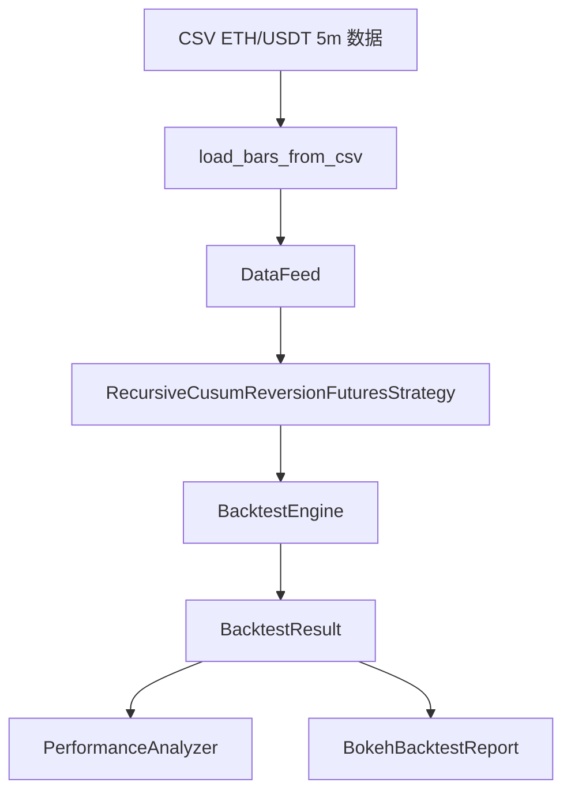

# 递归CUSUM反转策略在ETHUSDT五分钟数据上的实现与复盘

---

- 作者：山财小蒋
- 联系方式：2018036661@qq.com
- 项目地址：https://github.com/jianglang740/crypto_quant_framework.git
- 创作不易，转载请注明出处，欢迎批评探讨

---

- **前面几篇更多是在讲框架，这一篇回到一个具体策略：递归 CUSUM 反转策略。它不是为了证明某个策略一定有效，而是用一个完整例子展示如何把交易想法放进框架中运行、回测、分析和生成报告。**

- **从教程复盘角度看，这篇文章的重点也不是“CUSUM 多厉害”，而是策略如何继承 `StrategyBase`、如何使用 DataFeed、如何通过 BacktestEngine 撮合、如何接入绩效分析和 Bokeh 报告。**

---

## 1. 策略背景

前面几篇文章主要讲框架，这一篇回到具体策略。项目中的 `run_recursive_cusum_reversion_strategy.py` 实现了一个递归 CUSUM 反转策略，并在 ETH/USDT 5 分钟数据上进行合约回测。

这个策略的核心思想是：当短期累计上涨或累计下跌超过某个阈值时，认为市场可能出现阶段性过度波动，从而尝试做反向交易。

它不是一个成熟交易系统，而是一个适合学习的策略样例，用来展示如何在框架中完成：

1. 指标预计算；
2. 信号生成；
3. 多空反转；
4. 止盈止损；
5. 仓位控制；
6. 回测和报告输出。

## 2. CUSUM 的直观理解

CUSUM 是 cumulative sum 的缩写，可以理解为“累计偏离”。在策略中，我们不是只看某一根 K 线的收益，而是递归地累加一段时间内的正向或负向收益。

简化逻辑如下：

```text
pos_sum = max(0, pos_sum + 当前收益)
neg_sum = min(0, neg_sum + 当前收益)

如果 pos_sum 超过正阈值 -> 产生上涨过度信号
如果 neg_sum 跌破负阈值 -> 产生下跌过度信号
```

当累计正收益超过阈值，说明市场短期上涨较强；当累计负收益超过阈值，说明市场短期下跌较强。

这个项目中的策略选择从反转角度理解这些信号：上涨过度后可能回落，下跌过度后可能反弹。

## 3. 信号预计算

策略在 `on_init()` 中先把 DataFeed 转成 DataFrame，然后计算 log return：

```python
log_return = np.log(close / close.shift(1)).fillna(0)
```

之后遍历收益序列，递归更新正向累计和负向累计。如果超过阈值，就记录信号。

这种做法有一个优点：信号计算集中在初始化阶段，`on_bar()` 中只需要根据当前 cursor 取出对应信号，逻辑更清晰。

但也要注意：在真实实盘中，不能一次性看到未来全部数据。因此如果将这个策略迁移到实盘，需要把信号计算改成在线递推方式，而不是提前计算完整序列。

### 3.1 pandas 在信号预计算里做什么

这个策略会先把收盘价整理成 pandas Series。这样做的好处是可以很方便地对齐相邻 K 线：

```text
close[i]
close[i - 1]
```

然后通过 `shift(1)` 得到上一根 K 线的 close：

```python
close.shift(1)
```

这一步比手动写循环取上一根价格更直观，也更不容易写错。pandas 负责的是时间序列对齐和缺失值处理，例如第一根 K 线没有上一根 close，所以计算收益率后需要用 `fillna(0)` 处理。

### 3.2 numpy 在 log return 里做什么

numpy 主要用于计算对数收益率：

```python
log_return = np.log(close / close.shift(1)).fillna(0)
```

这里分三步理解：

```text
close / close.shift(1)     # 当前价格相对上一根价格的比例
np.log(...)                # 转成对数收益率
fillna(0)                  # 第一根没有上一根，填 0
```

为什么用对数收益率？因为对数收益率在连续累加时更方便。例如连续两段收益的对数可以相加，这和 CUSUM 的“累计偏离”思想更贴合。

### 3.3 CUSUM 递归更新为什么不用 rolling

很多指标可以用 rolling window 计算，比如均线：

```text
最近 20 根 close 的平均值
```

但 CUSUM 不是固定窗口均值，而是递归状态。每一根 K 线都会更新 `pos_sum` 和 `neg_sum`，一旦触发阈值就重置。因此它更适合用循环写：

```text
上一根 pos_sum / neg_sum
  -> 加上当前 log_return
  -> 判断是否超过 threshold
  -> 触发后重置累计值
```

这也是为什么策略中 pandas/numpy 负责准备收益率序列，而 CUSUM 主体仍然用显式循环实现。

## 4. 多空反转逻辑

策略运行在合约模式下，因此可以做多也可以做空。

当信号为 1 时，策略执行：

```text
如果当前有空头 -> 先平空
如果当前没有多头 -> 开多
```

当信号为 -1 时，策略执行：

```text
如果当前有多头 -> 先平多
如果当前没有空头 -> 开空
```

这就是典型的反转式持仓逻辑。策略不会同时持有多头和空头，而是在信号切换时完成方向切换。

## 5. 止盈止损设计

策略中加入了止盈止损参数：

```python
take_profit_rate = Decimal("0.018")
stop_loss_rate = Decimal("0.033")
```

对多头来说：

```text
pnl_rate = close / entry_price - 1
```

对空头来说：

```text
pnl_rate = entry_price / close - 1
```

如果收益达到止盈线，或者亏损达到止损线，就主动平仓。

止盈止损的意义在于，它不完全依赖下一次 CUSUM 信号，而是给每笔持仓一个独立的退出条件。这对于高波动的加密货币市场比较重要。

## 6. 仓位控制

策略没有满仓交易，而是通过 `position_ratio` 控制每次使用多少可用资金：

```python
amount = account.available * leverage * position_ratio / price
```

这说明仓位大小由三个因素决定：

1. 当前可用资金；
2. 杠杆倍数；
3. 仓位比例；
4. 当前价格。

相比固定数量下单，这种方式更接近按资金比例管理仓位，也方便在不同账户规模下复用策略。

## 7. 回测配置

示例中使用的回测配置包括：

```python
BacktestConfig(
    initial_cash=Decimal("10000"),
    commission_rate=Decimal("0.001"),
    slippage_rate=Decimal("0"),
    leverage=Decimal("10"),
)
```

这里初始资金为 10000，手续费率为 0.1%，杠杆为 10 倍。

需要注意的是，`slippage_rate` 设置为 0 会让结果相对乐观。真实交易中，尤其在市场波动剧烈时，滑点不可忽略。后续复盘时可以尝试提高滑点，观察策略是否仍然稳定。

## 8. 输出结果与报告

策略运行后，会输出：

- 最终账户状态；
- 绩效分析报告；
- 订单数量；
- 成交数量；
- Bokeh 回测报告 HTML。

这说明策略不是单纯打印收益，而是接入了项目中的完整回测链路：

```text
DataFeed -> Strategy -> BacktestEngine -> PerformanceAnalyzer -> BokehBacktestReport
```

从项目复盘角度看，这种链路比单个策略脚本更有价值，因为它体现了框架化能力。

## 9. 策略局限

这个递归 CUSUM 反转策略也有明显局限：

1. 阈值、止盈、止损可能对特定数据过拟合；
2. 反转假设在强趋势行情中可能失效；
3. 没有考虑资金费率；
4. 没有考虑真实盘口滑点；
5. 信号预计算方式需要改造后才能实盘化；
6. 单一品种、单一周期验证不足。

因此，它更适合作为框架示例和策略研究起点，而不是直接用于真实交易。

## 10. 后续优化方向

后续可以从几个方向继续改进：

1. 多周期验证，例如 5m、15m、1h；
2. 多品种验证，例如 BTC、ETH、SOL；
3. 加入趋势过滤，避免在强趋势中频繁反向；
4. 加入资金费率成本；
5. 使用 walk-forward 方法降低过拟合；
6. 将 CUSUM 信号改造成在线递推版本；
7. 接入 MySQL 保存每次策略运行结果。

## 11. 总结

递归 CUSUM 反转策略的价值，不只在于策略本身，而在于它展示了如何把一个交易想法放进完整框架中运行：先用 DataFeed 提供数据，再用 StrategyBase 实现逻辑，再由 BacktestEngine 撮合，最后通过绩效分析和 Bokeh 报告复盘。

这也是我搭建这个项目最想练习的能力：不是只写策略，而是让策略进入一个可复用、可分析、可扩展的量化研究流程。

## 12. 策略源码阅读路线

这一篇主要对应：

```text
my_strategys/run_recursive_cusum_reversion_strategy.py
crypto_quant/engine/backtest.py
crypto_quant/analysis/performance.py
crypto_quant/analysis/bokeh_report.py
```

阅读顺序建议：

1. 先看策略类 `RecursiveCusumReversionFuturesStrategy`；
2. 再看 `on_init()` 中如何计算 CUSUM 信号；
3. 再看 `on_bar()` 中如何根据信号切换多空；
4. 再看止盈止损函数；
5. 最后看 `main()` 中如何加载数据、创建引擎、运行回测、生成报告。

## 13. 策略参数的含义

这个策略有几个核心参数：

| 参数 | 含义 |
| --- | --- |
| `threshold` | CUSUM 累计收益触发阈值 |
| `take_profit_rate` | 止盈比例 |
| `stop_loss_rate` | 止损比例 |
| `position_ratio` | 每次开仓使用的可用资金比例 |
| `leverage` | 回测配置中的杠杆倍数 |
| `commission_rate` | 手续费率 |

这些参数共同决定策略的交易频率、风险暴露和收益波动。

例如，`threshold` 越小，信号越频繁；`position_ratio` 越大，仓位越重；`stop_loss_rate` 越宽，单笔亏损可能越大；`leverage` 越高，策略对价格波动越敏感。

## 14. CUSUM 策略的教程式伪代码

可以把策略逻辑写成伪代码：

```text
初始化：
    读取 close 序列
    计算 log return
    pos_sum = 0
    neg_sum = 0

遍历每个收益：
    pos_sum = max(0, pos_sum + return)
    neg_sum = min(0, neg_sum + return)

    如果 pos_sum >= threshold:
        记录做多信号
        清空累计值

    如果 neg_sum <= -threshold:
        记录做空信号
        清空累计值

每根 K 线：
    先检查止盈止损
    如果当前信号为做多：
        平空，再开多
    如果当前信号为做空：
        平多，再开空
```

这样看，这个策略其实分成三层：信号层、风控层、执行层。

## 15. 为什么要先检查止盈止损

在 `on_bar()` 中，策略先调用 `_check_take_profit_stop_loss(bar)`，如果触发止盈止损就直接返回，不再处理新信号。

这样做的含义是：风险退出优先于新信号开仓。因为如果当前持仓已经达到止损或止盈，就应该先完成退出，而不是同时处理反向信号导致逻辑混乱。

这是策略设计中一个很实用的顺序：

```text
先处理风险
再处理信号
最后处理开仓
```

## 16. 这个策略如何接入完整框架

它的运行链路是：



所以这篇策略文章不应该只看 CUSUM 本身，更应该看它如何完整使用项目框架。

## 17. 参数组合对策略行为的影响

这个策略的几个参数不是孤立的，它们会共同改变交易行为。

| 参数变化 | 可能结果 |
| --- | --- |
| `threshold` 变小 | 信号更频繁，交易次数增加，手续费影响更明显 |
| `threshold` 变大 | 信号更少，可能错过短期反转，但噪声更少 |
| `take_profit_rate` 变小 | 更容易止盈，单笔盈利变小，胜率可能提高 |
| `stop_loss_rate` 变大 | 给波动更多空间，但单笔亏损可能扩大 |
| `position_ratio` 变大 | 收益和回撤都会被放大 |
| `leverage` 变高 | 保证金占用下降，但强平风险上升 |

因此复盘时不能只看某一次参数结果。更合理的做法是对 `threshold`、止盈止损和仓位比例做网格实验，观察收益、回撤、交易次数和 profit factor 是否稳定。

如果一个策略只在某一组参数上表现很好，换一点参数就明显失效，就要警惕过拟合。

## 18. 当前回测结果应该怎样解读

说明文档中这组策略结果大致表现为：最终权益明显增长，胜率较高，但最大回撤也很大，交易次数较多。

这类结果不能简单理解为“策略很好”，而应该拆开看：

1. 高收益可能来自 10 倍杠杆和较高仓位使用率；
2. 最大回撤较大，说明真实运行中承受压力很强；
3. 交易次数多，手续费和滑点敏感性需要进一步测试；
4. profit factor 不算特别高，说明每单位亏损对应的盈利优势并不夸张；
5. 只在 ETH/USDT 5 分钟数据上验证，还不能说明跨品种、跨周期稳定。

所以这组结果更适合作为“框架功能跑通 + 策略研究样例”，而不是直接作为实盘结论。

## 19. 如何把预计算信号改成在线递推

当前策略在 `on_init()` 中一次性计算完整信号序列，这对回测很方便，但如果走向实盘，就应该改成在线递推。

在线版本的思路是把 `pos_sum` 和 `neg_sum` 保存为策略状态，每来一根新 K 线，只更新一次：

```text
读取当前 close 和上一根 close
计算当前 log_return
pos_sum = max(0, pos_sum + log_return)
neg_sum = min(0, neg_sum + log_return)

如果 pos_sum >= threshold:
    产生做多信号
    重置 pos_sum 和 neg_sum

如果 neg_sum <= -threshold:
    产生做空信号
    重置 pos_sum 和 neg_sum
```

这样策略就不需要提前看到完整历史数据，更符合实盘时间顺序。

## 20. 复盘这类策略时最应该问的问题

对于递归 CUSUM 反转策略，我会重点追问这些问题：

1. 收益主要来自震荡行情还是趋势行情？
2. 大回撤发生时，策略是在逆势加重风险，还是止损太慢？
3. 手续费提高一倍后，profit factor 是否明显下降？
4. 加入滑点后，收益是否仍然存在？
5. 降低杠杆后，收益和回撤是否更平衡？
6. 换成 BTC/USDT 或 15m 周期后，策略是否仍然有效？
7. 如果用 walk-forward 做参数选择，结果是否稳定？

这些问题比单看最终收益更重要，因为它们决定策略有没有继续研究的价值。

## 免责声明

本文仅为个人学习和项目复盘，不构成任何投资建议。CUSUM 反转策略存在失效风险，回测结果不代表未来收益，真实交易需谨慎。
